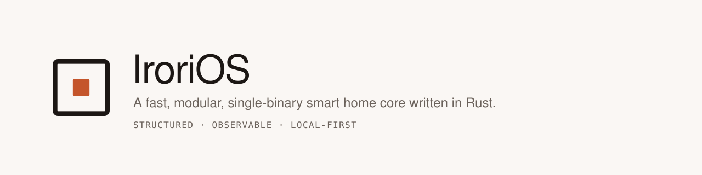

<h1 align="center">
  
</h1>

<p align="center">
  <a href="INSPIRATION.md"><b>Why and what</b></a> ·
  <a href="ROADMAP.md"><b>How and when</b></a> ·
  <a href="docs/specs/entities.md"><b>Entity model</b></a> ·
  <a href="docs/specs/extensions.md"><b>Extensions</b></a> ·
  <a href="dev/README.md"><b>Try it on a Mac</b></a>
</p>

> Status: the core's registry, live state, and extension host run; a Devices page shows everything and switches it (M0.8, M1.6 first slice); and **ESPHome devices on your network are found and connected automatically**, sensors and all (D26). No rules or automations yet, and no login, so it isn't running a home unattended.

## Build and run

Requires stable Rust (pinned via `rust-toolchain.toml`). One command builds the UI and installs
the binary, after which Irori runs from anywhere:

```sh
rustup target add wasm32-unknown-unknown   # once: what the UI compiles to
cargo install trunk --locked               # once: builds the UI
cargo xtask install                        # build the UI, install `irori`
irori run                                  # http://127.0.0.1:8480
```

`cargo xtask install` copies a binary; it isn't a link to the checkout. **After pulling or
changing anything, run it again** — the running `irori` is whatever was installed last. Which
build that is isn't a guess: every version is `0.0.0` until there are releases, so `irori
version` and the Home page show the commit it was built from, with `-modified` when the tree had
uncommitted changes.

```sh
irori version                              # irori 0.0.0 (359d176), built 2026-09-16 07:30 UTC
```

Everything the installed binary does:

```sh
irori run                                  # http://127.0.0.1:8480
irori run --log-level debug                # log every device and state change as it happens
irori run --data /var/lib/irori            # where the database lives (default ./data)
irori run --config ~/.config/irori         # where your rooms and names live (default ./config)
irori run --bind 0.0.0.0:8480 --allow-unauthenticated-lan   # reachable from your phone; see below
irori version --json
irori help run
```

`run` and `serve` are the same command. Every option is also an environment variable
(`IRORI_DATA`, `IRORI_CONFIG`, `IRORI_BIND`, `IRORI_LOG_LEVEL`, `IRORI_ALLOW_UNAUTHENTICATED_LAN`), which is what
the container uses. `irori help run` lists them with their defaults.

Or straight from the checkout, without installing — the same commands after `cargo run --`:

```sh
cargo run -- run                                # http://127.0.0.1:8480
cargo run -- run --log-level debug
cargo run --no-default-features -- run          # barebones: no integrations, no UI
```

The temporary API, for looking at the home without the page:

```sh
curl -s http://127.0.0.1:8480/api/dev/home     # the whole home in one response
                                               # (also /api/dev/{devices,entities,states,extensions})
```

The **web UI** is a separate wasm crate, so `cargo build` alone doesn't need a wasm toolchain and
serves a placeholder page at `/`. `cargo xtask install` above builds it; `cargo xtask ui` builds
it without installing. It has a Home page (what Irori is looking
after, by room), a Devices page (everything, with switches and an **Add device** panel explaining
where devices come from), and a Rooms page.

See [crates/irori-ui/README.md](crates/irori-ui/README.md) for working on the UI itself (live
reload, no binary rebuild). CI builds it, so downloaded release binaries always have it.

### Rooms, and what to call things

What a device calls itself is up to its firmware; what *you* call it is up to you. Both a name
and a room survive restarts, because they're written to a directory of plain TOML files:

```
config/
  areas.toml      the rooms of your home
  devices.toml    what you've called a device, and which room it's in
  entities.toml   what you've called an individual entity
```

Make rooms on the **Rooms** page; rename a device, or put it in a room, on its own page. Or open
the files in an editor — Irori picks up changes within a couple of seconds, and a file that
doesn't parse is ignored with an explanation in the log while the last good version keeps
running. There is no second copy in the database: the UI writes the same files you would.

A device that reports which room it thinks it's in (ESPHome's `area:`) never creates that room —
but making a room by that name collects every device that was asking for one.

See [docs/specs/config.md](docs/specs/config.md).

### ESPHome devices

Nothing to configure: Irori listens for ESPHome devices announcing themselves on the local
network, connects to each one, and puts everything it has on the Devices page. Lights and
switches can be switched from there.

The one catch today is **encryption**: ESPHome's API can require a pre-shared key, and Irori has
nowhere to keep a secret yet — the config dir exists, but `secrets.toml` is still to come (M0.7).
Devices asking for an encrypted connection are named in the log and skipped. Until then, a device
with a plain `api:` block (no `encryption:`) is picked up on its own.

If your ESPHome config has an `area:`, Irori notices it but doesn't act on it by itself: make a
room by that name and the device walks into it (see below).

See [integrations/irori-int-esphome/README.md](integrations/irori-int-esphome/README.md), which
also explains how to run a real ESPHome device on your laptop to try it without hardware.

## Run it like a Raspberry Pi (Docker)

`dev/pi` runs Irori in a Pi-like `linux/arm64` Debian container and runs the CI checks on
Linux arm64. It's the way to try a pull request on a Mac before approving it:

```sh
dev/pi up                             # http://127.0.0.1:8480
dev/pi review <pr-number>             # checkout, check, run, smoke test
```

See [dev/README.md](dev/README.md).

## Checks (same as CI)

```sh
cargo fmt --all --check
cargo clippy --locked --workspace --all-targets --all-features -- -D warnings
cargo clippy --locked -p irori --no-default-features --all-targets -- -D warnings
cargo test --locked --workspace --all-features
cargo test --locked -p irori --no-default-features
cargo xtask check-deps                # crate dependency rules, ROADMAP §2.1
cargo xtask check-docs                # the docs' default-feature claims match the manifest
cargo xtask schemas --check           # schemas/ matches irori-types (run without --check to update)
```

`dev/pi check` runs exactly this list on Linux arm64 in Docker.

CI also runs `cargo xtask ui` in a job of its own and checks the UI's download size against the
budget. It needs `trunk`, which the Pi container doesn't carry, so it isn't part of the list
above; run it on the host after changing the UI.

## Static binary for a Raspberry Pi

```sh
cargo install cargo-zigbuild          # also needs zig on PATH
rustup target add aarch64-unknown-linux-musl
cargo zigbuild --release -p irori --target aarch64-unknown-linux-musl
scp target/aarch64-unknown-linux-musl/release/irori pi@raspberrypi.local:
ssh pi@raspberrypi.local ./irori serve --bind 0.0.0.0:8480 --allow-unauthenticated-lan
```

Irori has no login yet, so it only listens on `127.0.0.1` unless you pass
`--allow-unauthenticated-lan`. Anyone on your network can then open the UI and switch your
devices — the temporary API sends commands as well as reading state. The flag goes away once
authentication exists (ROADMAP D12, M1.5).

CI runs on every pull request (and on every push to `main`). It builds `x86_64` and `aarch64` musl binaries, smoke-tests the `aarch64` one under QEMU, and uploads them as workflow artifacts.

## Layout

```
assets/        brand: logo marks, banner, favicon, social card (see assets/README.md)
docs/specs/    specifications: entities.md, extensions.md, integrations.md, config.md
schemas/       JSON Schemas generated from irori-types (`cargo xtask schemas`)
fixtures/      golden examples, valid and invalid, checked by the tests
crates/        irori-types, irori-core, irori-integration, irori-rules, irori-recorder,
               irori-config, irori-api, irori-client, irori (the binary), and irori-ui
               (the Leptos web UI: wasm, built by `cargo xtask ui`, outside the workspace)
integrations/  irori-int-mqtt, irori-int-demo, irori-int-esphome
extras/        irori-assist (opt-in AI, never in the default build)
xtask/         repository automation (`cargo xtask …`)
```

Most crates are empty shells for now; ROADMAP §2.1 describes what each will hold.
