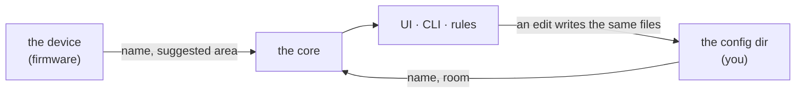

# Spec: the config directory

Status: **accepted for Phase 0** (M0.7). Changes go through a PR that updates this file, the
types in `crates/irori-types`, the loader in `crates/irori-config`, and the generated `schemas/`
together.

The CLI command tree that mirrors this (M1.7) is not in this spec; see ROADMAP §4.

---

## 1. Purpose

An integration tells Irori what a device *is*. Only a person can say what it's *for*: that the
board called `sensor-fusion-radar` is the hallway one, and that the hallway is a room.

Those decisions have to live somewhere, or they vanish at the next restart. They live in a
directory of plain text files that a person can read, edit, diff, and keep in git — not in the
database. Authored intent is config; observed facts are data (ROADMAP D18).



## 2. Where it is

`--config <dir>` (`IRORI_CONFIG`), default `./config`, alongside `--data` for runtime data. Irori
logs the absolute path at startup so there is never a question of which directory is in use.

A missing directory is not an error: Irori runs with nothing configured and creates the directory
on the first write. This is what a first run looks like, and a first run should not need a setup
step.

## 3. The files

```
config/
  irori.toml      settings for Irori itself          (reserved; §7)
  areas.toml      the rooms of the home
  devices.toml    what you have said about a device
  entities.toml   what you have said about an entity
```

Every file is optional. A file that is absent means "nothing said".

### 3.1 `areas.toml`

A table per area, keyed by its id. The id is what other files refer to; the name is what people
see and may change freely.

```toml
[areas.hall]
name = "Hall"

[areas.kitchen]
name = "Kitchen"
```

`floor` is reserved for when floors land; the `Floor` type already exists in `irori-types`.

### 3.2 `devices.toml`

```toml
[devices."esphome/34:98:7a:2b:09:00"]
name = "Hallway radar"
area = "hall"
```

Both fields are optional: a device may be renamed without being placed, or placed without being
renamed.

### 3.3 `entities.toml`

```toml
[entities."esphome/34:98:7a:2b:09:00-binary_sensor-1594977085"]
name = "Hallway occupancy"
```

## 4. What a decision is attached to

The key is `<integration>/<unique_id>` — the integration's own permanent handle for the thing,
which for an ESPHome device is its MAC address and for an entity is the id
`docs/specs/integrations.md` §4 defines.

It is deliberately **not** `DeviceId` or `EntityId`. Those are derived from names, so keying on
them would mean a rename could lose the very setting that caused it.

An entry for something Irori has never seen is kept, not dropped: a device that is unplugged for
a week comes back to the name it had. Nothing warns about it, because "the device is off right
now" and "this entry is stale" look identical from here.

## 5. Precedence

| Field | Wins |
|---|---|
| Device name | yours, else the integration's |
| Entity name | yours, else the integration's, else the device's name |
| Device area | yours, else an existing area whose name matches the device's `suggested_area` |

`suggested_area` is what the device says about itself — ESPHome's `area:`, for one. Irori
**never creates an area from a suggestion**: config changes when a person asks, not when a device
appears on the network. A suggestion that matches a room you already made is used, and a
suggestion is re-checked whenever areas change, so making a room named "Kitchen" quietly collects
the devices that were asking for it all along.

An entity with no name of its own follows its device's name, and keeps following it after a
rename. Naming the entity stops that.

## 6. Reading and writing

**Hot reload.** Irori checks the files every two seconds and reloads what changed. A file that
doesn't parse is rejected **whole**: the error is logged with the file and the reason, and the
last good version of *that file* stays live. A broken edit never leaves a home half-configured,
and never takes the other files down with it.

**A reference to a room that isn't there is a warning, not a rejection.** Areas and devices are
two files, and saving two files is two moments; rejecting `devices.toml` in the gap would make a
normal edit look like a failure. The entry is kept exactly as written, the device is simply left
unplaced, and it takes its place the moment the area exists.

**Writes are atomic.** Irori writes to a temporary file in the same directory and renames it over
the target, so a reader (or a crash) never sees half a file.

**The UI writes these files.** There is no second store: renaming a device in the UI and editing
`devices.toml` by hand are the same operation, and either is visible to the other within the
reload interval. Comments and key order in a hand-edited file are **not** preserved when Irori
rewrites it — a known cost of keeping one source of truth, and the reason the format is kept
flat and boring.

## 7. Not in this spec yet

Named here so the layout has room for them, specified when they are built:

- **`irori.toml`** — bind address, log level, which extensions are enabled, recorder retention.
  Today these are command-line flags; moving them is M1.1's config loading.
- **`extensions/<id>.toml`** — per-extension settings and approved permissions, validated against
  the extension's `config_schema` (`docs/specs/extensions.md`).
- **`secrets.toml`** — ESPHome encryption keys and anything else that must not be committed.
  This is what closes D29.
- **`rules/<id>.json`** — M0.3.
- **Floors**, and an entity belonging to a different area than its device (`Entity.area_id`
  already allows it).

## 8. Changes from the roadmap draft

ROADMAP M0.7 sketched the layout. This spec changes it:

- **Device and entity settings get their own files** (`devices.toml`, `entities.toml`), rather
  than living in `areas.toml`. Areas are a handful of lines that change once a year; device
  settings are a line per device and change whenever something is added. Mixing them makes the
  file that is mostly stable look busy.
- **Areas are a table keyed by id**, not a list, so the file can't define the same id twice.

## 9. Open questions

- **The default `./config` is relative to the working directory**, matching `--data`. That means
  `irori run` from two different directories is two different homes. A fixed
  `~/.config/irori` would be less surprising; changing it should change `--data` at the same
  time, so it is deliberately not changed here.
- **Should a stale entry expire?** An entry for a device that has not been seen in months is
  harmless but accumulates. Probably a `irori config prune` in M1.7 rather than anything
  automatic.
