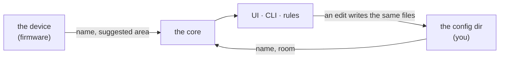

# Spec: the config directory

Status: **accepted for Phase 0** (M0.7). Changes go through a PR that updates this file, the
types in `crates/irori-types`, the loader in `crates/irori-config`, and the generated `schemas/`
together.

The CLI command tree that mirrors this (M1.7) is not in this spec; see ROADMAP §4.

---

## 1. Purpose

An integration tells Irori what a device *is*. Only a person can say what it's *for*: that the
board called `sensor-fusion-radar` is the hallway one, and that the hallway is a room.

Those decisions have to live somewhere, or they vanish at the next restart. They live in a
directory of plain text files that a person can read, edit, diff, and keep in git — not in the
database. Authored intent is config; observed facts are data (ROADMAP D18).



## 2. Where it is

`--config <dir>` (`IRORI_CONFIG`), default `./config`, alongside `--data` for runtime data. Irori
logs the absolute path at startup so there is never a question of which directory is in use.

A missing directory is not an error: Irori runs with nothing configured and creates the directory
on the first write. This is what a first run looks like, and a first run should not need a setup
step.

## 3. The files

```
config/
  irori.toml      settings for Irori itself: address, log level, extensions turned off
  areas.toml      the floors and rooms of the home
  devices.toml    what you have said about a device
  entities.toml   what you have said about an entity
  secrets.toml    keys, passwords, tokens — one table per extension
  extensions/
    <id>.toml     an extension's settings that aren't secret
  rules/
    <id>.json     a rule ([rules.md](rules.md))
```

Every file is optional. A file that is absent means "nothing said".

### 3.1 `areas.toml`

A table per area, keyed by its id. The id is what other files refer to; the name is what people
see and may change freely.

```toml
[areas.hall]
name = "Hall"

[areas.kitchen]
name = "Kitchen"
floor = "ground"

[floors.ground]
name = "Ground floor"
level = 0

[floors.upstairs]
name = "Upstairs"
level = 1
```

A **floor** groups rooms. `level` is a whole number that orders floors, lowest first: 0 for the
entrance floor, 1 above it, -1 for a cellar. Two floors may share a level (a split-level house).
A room's `floor` is optional; a room without one is listed after the floors. A `floor` naming a
floor that isn't there is a warning, not a rejection (§6): removing a floor leaves its rooms where
they are, listed without a floor.

### 3.2 `devices.toml`

```toml
[devices.esphome_34_98_7a_2b_09_00]
name = "Hallway radar"
description = "Above the front door, facing the stairs"
area = "hall"          # a room's id, or `false` for "not in one"
```

Keyed by the device's id — the same id as its page's address and in the API (§4). Every field is
optional. `name` and `description` are the device's **only** name and description: nothing else
in Irori keeps a second one to fall out of step with (ROADMAP D36).

`ignored = true` keeps the device out of the home altogether: it isn't listed, can't be switched,
and nothing it reports is kept. Its integration may go on talking to it; Irori just doesn't let
it in. What the integration says meanwhile is remembered, so taking `ignored` away puts the device
back as it is now, without a restart.

`added = true` records that the device is in the home: a person added it while Irori was asking
(`[devices] new = "ask"` in `irori.toml`, §3.5), or it joined while asking was off and Irori
wrote this so a later restart with asking already on doesn't hold it as new. Any other entry
for the device (a name, a room) is the same decision — that device is not new. Turning asking
on marks every device already in the home as added, so switching the setting on never empties
the home.

`area` has **three** states, not two, because "nobody has said" and "it isn't in a room" are
different answers:

| `area` | Means |
|---|---|
| absent | Nobody has said. The device's `suggested_area` may stand in (§5). |
| `"hall"` | That room. |
| `false` | Deliberately no room — the suggestion doesn't get to overrule it. |

Without the third state, telling Irori that a device suggesting "Study" is *not* in the study
would only clear the setting, let the suggestion back in, and put the device straight back. A
word like `"none"` would read better than `false`, but `none` is a perfectly good room id, so the
two have to be different types rather than different spellings. `area = true` is an error.

### 3.3 `entities.toml`

```toml
[entities."esphome/34:98:7a:2b:09:00-binary_sensor-1594977085"]   # <integration>/<unique_id>
name = "Hallway occupancy"
```

### 3.4 `secrets.toml`

One table per extension, holding that extension's secret settings. Settings that aren't secret go
in `extensions/<id>.toml` (§3.6), and the two are joined.

```toml
[esphome.keys]
"00:11:22:33:44:55" = "QkJCQkJCQkJCQkJCQkJCQkJCQkJCQkJCQkJCQkJCQkI=="
```

An extension receives exactly its own table, checks it against its own config type, and is
restarted when that table changes ([integrations.md](integrations.md) §3). What's inside is the
extension's business: the ESPHome extension's shape is in its README.

Handled as a secret throughout:

- **Irori writes it readable by its own user only** (`0600`), setting the permission before
  writing a byte. A file a person created keeps their permissions until Irori next writes it.
- **Nothing quotes it.** A parse error names the line, never its contents (TOML's own messages
  would print the line). Settings types don't print their values in `Debug`. A value an
  extension rejects is described without being repeated.
- **The API writes it but never reads it back**, and writes only where an extension is asking
  ([integrations.md](integrations.md) §6.6).
- **Kept out of git.** The rest of the directory is meant to be committed; this file isn't. When
  Irori writes `secrets.toml` into a directory with no `.gitignore`, it adds one naming it, so
  `git add .` in the config directory can't pick it up by accident. An existing `.gitignore` is
  never touched.

### 3.5 `irori.toml`

Settings for Irori itself. Irori only ever reads this file: nothing it serves can write it, which
matters while there's no sign-in, because `allow_unauthenticated_lan` is here.

```toml
[server]
bind = "0.0.0.0:8480"
allow_unauthenticated_lan = true
log_level = "info"            # error, warn, info, debug, trace
data = "/var/lib/irori"       # relative paths are relative to this directory

[extensions]
disabled = ["demo"]

[devices]
new = "ask"                   # "add" (the default) or "ask"
```

A command-line flag, or its environment variable, wins over the file, and the file wins over the
default. `[server]` is read at startup; changing it while Irori runs logs that a restart is
needed. `[extensions] disabled` applies while Irori runs: naming an extension stops it, removing
it starts it again.

`[devices] new` is what happens when an integration finds a device nobody has decided about.
`"add"` puts it in the home straight away. `"ask"` holds it back, as if ignored, until a person
adds it (`added = true`) or ignores it (`ignored = true`) from the Devices page — the way to stop
a busy network filling the home with a neighbour's plugs. A device that already has a
`devices.toml` entry is not new: it stays in the home. Irori writes `added = true` for devices
that join while asking is off, so restarting with asking already on doesn't empty the home.
What the integration says about a held device is kept, so adding it shows it as it is now. It
applies while Irori runs.

### 3.6 `extensions/<id>.toml`

An extension's settings that aren't secret. Irori writes a header comment saying so when it
creates the file.

```toml
# extensions/helpers.toml
[toggles.guests_are_over]
name = "Guests are over"
initial = false
```

The extension receives this file **joined** with its table in `secrets.toml` (§3.4), as one table,
checked against its own config type. A key present in both is a mistake: the secret wins, so a
password isn't silently replaced by a placeholder, and the clash is logged once, naming the key
but not its value. Changing either file restarts the extension (ROADMAP D34). A file for an
extension that isn't installed is kept and does nothing.

Unlike `secrets.toml`, this file is meant to be committed, and the API reads it: an endpoint that
edits it does so on behalf of the extension it belongs to — the helpers endpoints write
`extensions/helpers.toml` — never as a general "write any extension's settings" call.

**Helpers** keep their definitions here. A toggle is a switch Irori keeps itself — "guests are
over", "holiday mode" — with the entity id `switch.<id>`. `name` is its one name: renaming the
entity from the UI rewrites it here, not in `entities.toml`, so there's no second name (D36).
`initial` is its value before anyone has switched it; after that, the value it was left at is kept
in the extension's private storage (`integrations.md` §5) through restarts. Removing a toggle
removes its entity and forgets its value.
## 4. What a decision is attached to

**A device** is attached to its id. A device's id is made from its integration and the
integration's permanent handle for it — `esphome_34_98_7a_2b_09_00` from `esphome` and the MAC
address — and from nothing else, so it's the same after every restart and whatever the device is
called. Handles that slug to the same id (differing only in case or punctuation) are refused
rather than numbered in arrival order; a handle too long for an id keeps its start and gains a
hash of the whole.

**An entity** is attached to `<integration>/<unique_id>`, which for an ESPHome entity is the id
`docs/specs/integrations.md` §4 defines. An entity id is readable (`sensor.<device id>_temperature`)
and built from what its integration calls it, so the integration's handle is the one thing that
can't drift from it.

An entry for something Irori has never seen is kept, not dropped: a device that is unplugged for
a week comes back to the name it had. Nothing warns about it, because "the device is off right
now" and "this entry is stale" look identical from here.

## 5. Precedence

| Field | Wins |
|---|---|
| Device name | yours, else the integration's — shown alone, never beside the other |
| Device description | yours; integrations don't set one |
| Entity name | yours, else the integration's, else the device's name |
| Device area | yours (a room, or a deliberate none), else an existing area whose name matches the device's `suggested_area` |

`suggested_area` is what the device says about itself — ESPHome's `area:`, for one. Irori
**never creates an area from a suggestion**: config changes when a person asks, not when a device
appears on the network. A suggestion that matches a room you already made is used, and a
suggestion is re-checked whenever areas change, so making a room named "Kitchen" quietly collects
the devices that were asking for it all along.

An entity with no name of its own follows its device's name, and keeps following it after a
rename. Naming the entity stops that.

## 6. Reading and writing

**Hot reload.** Irori checks the files every two seconds and reloads what changed. A file that
doesn't parse is rejected **whole**: the error is logged with the file and the reason, and the
last good version of *that file* stays live. A broken edit never leaves a home half-configured,
and never takes the other files down with it.

**A reference to a room that isn't there is a warning, not a rejection.** Areas and devices are
two files, and saving two files is two moments; rejecting `devices.toml` in the gap would make a
normal edit look like a failure. The entry is kept exactly as written, the device is simply left
unplaced, and it takes its place the moment the area exists.

**Writes are atomic, and a save is all or nothing.** Each file is written to a temporary one in
the same directory and only then renamed over the target, so a reader (or a crash) never sees half
a file. Across files, every temporary is written before *any* of them is renamed: writing bytes is
where a full disk shows up, renaming an existing file on the same filesystem is as close to
infallible as a filesystem gets, so a failure leaves the directory exactly as it was rather than
half-changed — which the next reload would otherwise adopt as if someone had meant it.

**The UI writes these files.** There is no second store: renaming a device in the UI and editing
`devices.toml` by hand are the same operation, and either is visible to the other within the
reload interval. Comments and key order in a hand-edited file are **not** preserved when Irori
rewrites it — a known cost of keeping one source of truth, and the reason the format is kept
flat and boring.

## 7. Not in this spec yet

Named here so the layout has room for them, specified when they are built:

- **More of `irori.toml`** — location, recorder retention.
- **Approved permissions** in `extensions/<id>.toml`, and validating it against the extension's
  `config_schema` before it starts (`docs/specs/extensions.md`). Today the extension's own config
  type checks it, and an extension with invalid settings waits for valid ones.
- **`rules/<id>.json`** — specified in [rules.md](rules.md).
- **An entity in a different area than its device** (`Entity.area_id` already allows it).
- **More helpers** — numbers, text, timers — once rules can use them.

## 8. Changes from the roadmap draft

ROADMAP M0.7 sketched the layout. This spec changes it:

- **Device and entity settings get their own files** (`devices.toml`, `entities.toml`), rather
  than living in `areas.toml`. Areas are a handful of lines that change once a year; device
  settings are a line per device and change whenever something is added. Mixing them makes the
  file that is mostly stable look busy.
- **Areas are a table keyed by id**, not a list, so the file can't define the same id twice.

## 9. Open questions

- **The default `./config` is relative to the working directory**, matching `--data`. That means
  `irori run` from two different directories is two different homes. A fixed
  `~/.config/irori` would be less surprising; changing it should change `--data` at the same
  time, so it is deliberately not changed here.
- **Should a stale entry expire?** An entry for a device that has not been seen in months is
  harmless but accumulates. Probably a `irori config prune` in M1.7 rather than anything
  automatic.
