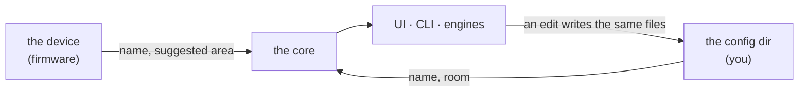

# Spec: the config directory

Status: **accepted for Phase 0** (M0.7). Changes go through a PR that updates this file, the
types in `crates/irori-types`, the loader in `crates/irori-config`, and the generated `schemas/`
together.

The CLI command tree that mirrors this (M1.7) is not in this spec; see ROADMAP §4.

---

## 1. Purpose

A protocol tells Irori what a device *is*. Only a person can say what it's *for*: that the
board called `sensor-fusion-radar` is the hallway one, and that the hallway is a room.

Those decisions have to live somewhere, or they vanish at the next restart. They live in a
directory of plain text files that a person can read, edit, diff, and keep in git — not in the
database. Authored intent is config; observed facts are data (ROADMAP D18).


```mermaid
flowchart LR
    device["the device<br/>(firmware)"] -->|name, suggested area| core
    config["the config dir<br/>(you)"] -->|name, room| core
    core["the core"] --> ui["UI · CLI · engines"]
    ui -->|"an edit writes the same files"| config
```

## 2. Where it is

`--config <dir>` (`IRORI_CONFIG`), default `./config`, alongside `--data` for runtime data. Irori
logs the absolute path at startup so there is never a question of which directory is in use.

A missing directory is not an error: Irori runs with nothing configured and creates the directory
on the first write. This is what a first run looks like, and a first run should not need a setup
step.

The page does have one. Until the home has an owner, the page opens on a welcome that asks who
you are, with a password, and then what time zone the home is in (§3.9, §3.10). The owner's
password is not optional: a home is reached from more than the room it is in, and the password
is what makes it somebody's. The time zone is filled in from the browser. Both are in Settings
afterwards.

What a first run doesn't need is anything before that: Irori starts, finds devices and serves its
API with nothing configured, which is what lets it be installed, scripted and checked before
anybody opens the page. That open state ends the moment the owner is set up.

## 3. The files

```
config/
  irori.toml      settings for Irori itself: address, log level, extensions turned off
  areas.toml      the floors and rooms of the home
  floorplan.toml  the home as it is drawn: walls, doors, windows, where devices sit
  devices.toml    what you have said about a device
  entities.toml   what you have said about an entity
  secrets.toml    keys, passwords, tokens — one table per extension
  assistant.toml  which model answers, when one does (the key stays in secrets.toml)
  home.toml       where the home is, and its time zone
  users.toml      the people allowed in, and what each may do
  extensions/
    <id>.toml     an extension's settings that aren't secret
```

Every file is optional. A file that is absent means "nothing said".

### 3.1 `areas.toml`

A table per area, keyed by its id. The id is what other files refer to; the name is what people
see and may change freely.

```toml
[areas.hall]
name = "Hall"

[areas.kitchen]
name = "Kitchen"
floor = "ground"

[floors.ground]
name = "Ground floor"
level = 0

[floors.upstairs]
name = "Upstairs"
level = 1
```

A **floor** groups rooms. `level` is a whole number that orders floors, lowest first: 0 for the
entrance floor, 1 above it, -1 for a cellar. Two floors may share a level (a split-level house).
A room's `floor` is optional; a room without one is listed after the floors. A `floor` naming a
floor that isn't there is a warning, not a rejection (§6): removing a floor leaves its rooms where
they are, listed without a floor.

### 3.2 `devices.toml`

```toml
[devices.esphome_34_98_7a_2b_09_00]
name = "Hallway radar"
description = "Above the front door, facing the stairs"
area = "hall"          # a room's id, or `false` for "not in one"
```

Keyed by the device's id — the same id as its page's address and in the API (§4). Every field is
optional. `name` and `description` are the device's **only** name and description: nothing else
in Irori keeps a second one to fall out of step with (ROADMAP D36).

A device joins the home only when a person adds it. What an extension finds is a proposal, not a
decision: installing one never puts whatever is on the network into the home. Until it's added,
a found device is listed under **+ Add device**, on the screen for the extension that found it,
and nowhere else — it isn't on the Devices page, can't be switched, and nothing it reports is
kept. Its protocol goes on talking to it, and what it says is remembered, so adding it shows it
as it is now.

`added = true` records that a person added the device. Any other entry for the device (a name,
a room) is the same decision — that device is in the home. Earlier versions of Irori wrote
`added = true` for every device already in the home, so a home kept its devices across the change
to adding them by hand.

**Removing** a device takes everything Irori keeps of it out of these files: its row here, its
entities' rows, and its spot on the floorplan. The device goes back to being found, listed under
**+ Add device**.

A device whose protocol keeps a network of its own is different (Zigbee;
[protocols.md](protocols.md) §5.1). Leaving it paired would leave it on the network, still
talking, and offered again as if it were new. So removing it unpairs it first:

- If the network lets it go, it is gone altogether. It has to be paired again to come back.
- If the device doesn't answer, nothing is removed and the page says why. A battery device is
  asleep most of the time, so this is common. The page then offers to remove it anyway, which
  drops it from the network's records without the device agreeing. That device may need a factory
  reset before it will pair again.
- Such a device can also be unpaired while it's only found, which is how to undo pairing the
  wrong thing.
- Removing from the home never becomes impossible. Removed anyway, a device leaves the home even
  when its network can't be asked at all (the extension stopped, the dongle unplugged); it is
  then found again if its protocol still knows it. The network's own controller has nothing to
  unpair, so removing it is only ever removing it from the home.

`ignored = true` is from when a device could be ignored rather than removed. A row that says it
still reads, so the rest of the file isn't refused, but that device is simply not in the home:
it's listed as found, to be added if wanted, and Irori drops the row the next time it writes the
file.

`area` has **three** states, not two, because "nobody has said" and "it isn't in a room" are
different answers:

| `area` | Means |
|---|---|
| absent | Nobody has said. The device's `suggested_area` may stand in (§5). |
| `"hall"` | That room. |
| `false` | Deliberately no room — the suggestion doesn't get to overrule it. |

Without the third state, telling Irori that a device suggesting "Study" is *not* in the study
would only clear the setting, let the suggestion back in, and put the device straight back. A
word like `"none"` would read better than `false`, but `none` is a perfectly good room id, so the
two have to be different types rather than different spellings. `area = true` is an error.

Removing a device — the "Remove" on its page — deletes everything Irori keeps of it: its row in
this file, its entities' rows in `entities.toml`, its spot on the floorplan, and the history of its
readings (ROADMAP D48). Nothing in Irori can refer to it afterwards, and once the files say nothing
about it, a restart can't bring it back. The device itself isn't told: it goes straight back to
being one its extension has found, listed under **+ Add device** at once — without waiting for it
to announce itself again — to be added back like any new device. `secrets.toml` is left alone:
which of an extension's secrets belongs to which device is the extension's business, and a key is
what an encrypted device needs to be added back.

Uninstalling an extension removes every device it brought in the same way, including ones that
aren't around at the time, so installing it again starts with nothing of it in the home.

### 3.3 `entities.toml`

```toml
[entities."esphome/34:98:7a:2b:09:00-binary_sensor-1594977085"]   # <protocol>/<unique_id>
name = "Hallway occupancy"
```

### 3.4 `secrets.toml`

One table per extension, holding that extension's secret settings. Settings that aren't secret go
in `extensions/<id>.toml` (§3.6), and the two are joined.

```toml
[esphome.keys]
"00:11:22:33:44:55" = "QkJCQkJCQkJCQkJCQkJCQkJCQkJCQkJCQkJCQkJCQkI="
```

An extension receives exactly its own table, checks it against its own config type, and is
restarted when that table changes ([protocols.md](protocols.md) §3). What's inside is the
extension's business: the ESPHome extension's shape is in its README.

Two tables are Irori's own and no extension's: `[assistant]` (§3.8), and `[users]`, which holds
the hash of each person's password under `[users.passwords]` (§3.10).

Handled as a secret throughout:

- **Irori writes it readable by its own user only** (`0600`), setting the permission before
  writing a byte. A file a person created keeps their permissions until Irori next writes it.
- **Nothing quotes it.** A parse error names the line, never its contents (TOML's own messages
  would print the line). Settings types don't print their values in `Debug`. A value an
  extension rejects is described without being repeated.
- **The API writes it but never reads it back**, and writes only where an extension is asking
  ([protocols.md](protocols.md) §6.6).
- **Kept out of git.** The rest of the directory is meant to be committed; this file isn't. When
  Irori writes `secrets.toml` into a directory with no `.gitignore`, it adds one naming it, so
  `git add .` in the config directory can't pick it up by accident. An existing `.gitignore` is
  never touched.

### 3.5 `irori.toml`

Settings for Irori itself. Irori only ever reads this file: nothing it serves can write it, which
matters while there's no sign-in, because `allow_unauthenticated_lan` is here.

```toml
[server]
bind = "0.0.0.0:8480"
bind_fallback = "127.0.0.1:8481"  # optional: where to listen if bind is already taken
allow_unauthenticated_lan = true
tls = true                    # serve over https; see below
log_level = "info"            # error, warn, info, debug, trace
data = "/var/lib/irori"       # relative paths are relative to this directory

[extensions]
disabled = ["demo"]

```

A command-line flag, or its environment variable, wins over the file, and the file wins over the
default. `[server]` is read at startup; changing it while Irori runs logs that a restart is
needed. `[extensions] disabled` applies while Irori runs: naming an extension stops it, removing
it starts it again.

If `bind` is already in use when Irori starts, it listens on `bind_fallback` instead (or, if none
is set, on the first free port just above `bind`, up to nine ports higher) and logs a warning with
the address it actually chose. `--bind-fallback` and `IRORI_BIND_FALLBACK` say the same as this
setting. Setting `bind_fallback` equal to `bind` locks the port: Irori tries only `bind` and fails
loudly if it's taken, never stepping — the way to keep a fixed published and health-checked port
(e.g. the dev container) on the address everything expects.

`tls` (also `--tls`, `IRORI_TLS`) serves https, so the password and the session cookie travel
encrypted and the cookie is marked for https only. It is off unless asked for. The certificate
is `tls/cert.pem` with its key `tls/key.pem` in the data directory:

- If neither is there, Irori makes its own the first time, for this machine's names and
  addresses, and keeps it. No browser has heard of a certificate a home makes for itself, so the
  browser warns once and asks to be told it is fine. What travels is encrypted either way.
- A certificate a browser does trust (from a private CA, or a DNS-validated one) goes in the same
  two files and is used as it is. A certificate that can't be read, or a key that doesn't go
  with it, stops Irori from starting and says which file; it never falls back to plain http.

Without `tls`, a home reached over the network sends passwords in the clear, and Irori says so
in its log when it starts.

`log_level` decides how much Irori says, and it is read once at startup: a quiet instance has less
in its log to read, including in the log window on the Settings page, which shows the same lines
Irori wrote rather than a filtered copy of them. Nothing else chooses a level of its own — there is
no per-extension level, and an extension logs at its own process's default, which Irori passes on
verbatim. `--log-level` and `IRORI_LOG_LEVEL` say the same as this setting; `debug` is where every
device and state change shows up.

`[devices] new` (`"ask"` or `"add"`) is from when a found device could join the home on its own.
It no longer does anything: a device joins when a person adds it (§3.2). An `irori.toml` that
still says it is read as usual, and Irori logs once that the setting is no longer used.

### 3.6 `extensions/<id>.toml`

An extension's settings that aren't secret. Irori writes a header comment saying so when it
creates the file.

```toml
# extensions/helpers.toml
[toggles.guests_are_over]
name = "Guests are over"
initial = false
```

The extension receives this file **joined** with its table in `secrets.toml` (§3.4), as one table,
checked against its own config type. A key present in both is a mistake: the secret wins, so a
password isn't silently replaced by a placeholder, and the clash is logged once, naming the key
but not its value. Changing either file restarts the extension (ROADMAP D34). A file for an
extension that isn't installed is kept and does nothing.

Unlike `secrets.toml`, this file is meant to be committed, and the API reads it: an endpoint that
edits it does so on behalf of the extension it belongs to — the helpers endpoints write
`extensions/helpers.toml` — never as a general "write any extension's settings" call.

**Helpers** keep their definitions here. A toggle is a switch Irori keeps itself — "guests are
over", "holiday mode" — with the entity id `switch.<id>`. `name` is its one name: renaming the
entity from the UI rewrites it here, not in `entities.toml`, so there's no second name (D36).
`initial` is its value before anyone has switched it; after that, the value it was left at is kept
in the extension's private storage (`protocols.md` §5) through restarts. Removing a toggle
removes its entity and forgets its value.
### 3.7 `floorplan.toml`

The home as a drawing, **a floor at a time**. Nothing discovers this — no protocol can tell
Irori where a wall is — so it is authored intent from end to end, and it lives here rather than
in the database with the rest of it.

```toml
[[floors.ground.walls]]
from = [0, 0]
to = [500, 0]
thickness = 20

[[floors.ground.walls.openings]]
kind = "door"       # "door" or "window"
at = 250            # centimetres along the wall, from its `from` end, to the middle of the hole
width = 80

[[floors.ground.walls.openings]]
kind = "door"
at = 420
width = 90
side = "right"          # optional: which side it opens to, looking from `from` to `to`
hinge = "far"           # optional: which end of the gap a door hangs from
sensor = "binary_sensor.front_door_contact"   # optional: says whether it's open

[[floors.ground.areas]]
area = "kitchen"
points = [[0, 0], [300, 0], [300, 250], [0, 250]]
label = [0, -40]        # optional: how far the room's name is drawn from its middle

[[floors.ground.devices]]
device = "demo_lamp"
at = [120, 90]

[[floors.ground.devices]]
device = "demo_mmwave_sensor"
at = [0, 150]
facing = 0              # optional: which way a directional sensor points, in degrees
field_of_view = 100     # optional: how wide it sees, in degrees
```

Keyed by the **floor's id** from §3.1, because a plan *is* the plan of a floor: a house with an
upstairs has two of them, drawn one over the other. A home nobody has divided into floors has
nowhere to draw until it has one, which is a question with an obvious answer rather than a reason
for a second shape of file.

Every measurement is a **whole centimetre**, and a point is `[x, y]` — x rightwards, y downwards,
from an origin that is wherever whoever drew it started. Whole numbers because a plan has to
compare equal to itself (the core skips work when settings haven't changed, which floats can't
promise), and because round numbers diff cleanly in the git repository this directory is meant
to live in. A centimetre is finer than anyone draws a house.

An **opening is part of the wall it is cut into**, not a thing beside it, so it is placed by how
far along that wall it is. Moving a wall carries its doors with it, deleting a wall takes them
too, and a door can never end up floating next to the wall it belongs to. `thickness` is drawn,
not structural: it decides how heavy the line looks, and defaults to 10 cm.

An **area is given a shape here, not defined here.** Rooms are made in `areas.toml` (§3.1); this
only says where one is, as a closed run of corners — the last joins back to the first, so the
file can't disagree with itself about where the room closes. A room with no shape is simply not
drawn. The same room may be traced on more than one floor (a stairwell, a double-height hall),
but only once per floor: a room in two pieces on one floor is a room somebody drew twice.

A room's **name is drawn at the middle of it** unless `label` says otherwise: an offset, in
centimetres, that the name is drawn from the middle by. It is an offset rather than a place of
its own so a name somebody dragged travels with the room — stretch a wall and the label stays
where it was put, relative to the room it belongs to. Omitted, the label sits at the middle, and
a plan written before the field existed reads the same way.

A device is placed by its id, the same one `devices.toml` uses. An entry for a device that isn't
in the home right now is **kept and simply not drawn** (§4), as is an entry for a floor or room
that has since been removed — a device unplugged for a week comes back to the spot it was put in,
and making a deleted floor again brings its drawing back.

A door or window can say **which way it opens and whether it is open**. `side` is the side of
the wall it swings to, `"left"` or `"right"`, standing at the wall's `from` end and looking
towards `to`; left when it isn't said, which is how every door was drawn before the field
existed. `hinge` is the end of the gap a door hangs from, `"near"` (the `from` end, and the
default) or `"far"`; a window is hinged at both jambs, so it has no use for it. `sensor` is the
id of the contact sensor on it: a `binary_sensor` whose `on` means open. With one, the plan
draws the door or window open and shut as the sensor says, and a radar's field stops at a door
that is shut. Without one it is drawn shut — a plan shouldn't claim a door is open that nothing
says is. A `sensor` that names an entity no longer in the home is kept and not obeyed (§4), and
none of the three is written when it holds its default.

A device that **looks in one direction** — an mmWave presence sensor on a wall — can be aimed.
`facing` is which way it points, in whole degrees clockwise from the plan's +x axis as the plan
is drawn: `0` is rightwards, `90` is down the page, `0` to `359`. `field_of_view` is how wide it
sees, `20` to `180` degrees, and is 100 when `facing` is set and it isn't. Both are authored for
the same reason the walls are: a radar reports that someone is 1.8 m away, and nothing it reports
says which wall it was screwed to. The page uses them to draw what the sensor can see — stopped
by walls, let through by doors — and where in it the target is. Left out, the device is drawn as
a point that looks nowhere in particular, which is what every plan written before these fields
existed says.

Some rules are enforced rather than warned about, because breaking any of them leaves a plan
that can't be drawn at all: a wall must have some length (a wall with none has no direction, so
its openings have nowhere to sit), an opening must fit inside its wall, a room's shape needs
at least three corners, and a `facing` or `field_of_view` must be inside its range. A file that breaks one is rejected whole, like any other unparseable file
(§6), and the UI is held to exactly the same rules. A refusal says which floor it is about,
because that is the first thing anybody needs in order to go and look.

The Floorplan page **replaces the whole file at once** when somebody presses Save, rather than
editing a wall at a time. The editor works on a copy while it is being drawn, so a half-finished
room never reaches the file and Cancel is simply never sending it.

**Saving a plan also answers `devices.toml`.** A device drawn standing inside a room is a person
saying which room it is in, so the save puts it there (§3.2, `area`). A plan that knew and didn't
say would be a drawing rather than part of the home. Two limits, and they are the point:

- A **deliberate** `area = false` is never overruled. That answer exists so that a guess — the
  device's own `suggested_area` — can't put the device back, and a dot standing on a floor is
  another guess. Only `area` that is absent, or names some other room, is changed.
- A room that isn't in `areas.toml` is not used, the same as anywhere else a missing reference
  is kept rather than obeyed (§6).

The save says how many devices it moved, so a write to a second file is never silent.

### 3.8 `assistant.toml`

Which model answers questions about the home. Absent means the assistant is off. The file is
read by the assistant in the `irori` binary, not by the shared loader in `irori-config`, and a
file that does not parse is logged and treated as absent.

```toml
mode = "off"            # "off", "local", or "cloud"
instructions = ""       # what the assistant is told to keep to, in your words; left out when empty

[local]
tag = "qwen3:1.7b"      # an Ollama library tag; this one is the default
context = 4096          # tokens of conversation the model is loaded with room for

[cloud]
preset = "openai"       # "openai", "anthropic", "grok", or "compatible"
base_url = "https://api.openai.com/v1"
model = ""
```

`local.tag` is a name Ollama already understands (`qwen3:1.7b`, any other tag from the
Ollama library, or `hf.co/<user>/<repo>` for a GGUF on Hugging Face). The address of a model's
page is accepted and stored as the tag it is the page of. Irori does not ship the weights or
Ollama. It talks to the Ollama listening on `127.0.0.1:11434`. If none is, Settings can
install one: Ollama's own release, checked against its published checksum, unpacked into
`ollama/` in the data directory and run from there as `ollama serve` on this machine only,
with its models in the same directory. What it says goes to `ollama.log` beside it, which
Settings shows as the model log. Uninstalling removes that directory. An Ollama you
installed yourself is used as it is and never removed. Unpacking needs `tar`, and `zstd` on
Linux. A tag that is larger than the free memory on the machine can be downloaded and still
not be used.

`local.context` is how many tokens the model holds at once: the picture of the home it is
handed, the conversation so far, and its answer. It is between 2048 and 262144, and a model is
never loaded with more than it says it was made for. The memory a model takes once loaded
grows with it, and so does how much of the home and of the conversation a model on this
machine is handed, which is cut to fit 4096 tokens otherwise. Changing it while the model is
in memory loads the model again, and is refused, with nothing written, if it would no longer
fit. After each answer Irori keeps how many tokens that answer took (the provider's own
count, or about four characters a token where it gives none), and a chat shows it: as a share
of the context for a model on this machine, and as a count for a cloud model, whose context
is its provider's to know.

`instructions` is text of your own, at most 4000 characters, put in front of every question in
every conversation: how to answer, what to call things, what you care about. It changes what
the assistant says and nothing it can do. For a model on this machine it comes out of the
context.

`cloud` is an endpoint. `openai` and `grok` and `compatible` speak the OpenAI chat API.
`anthropic` speaks Anthropic's. An empty `base_url` is filled from the preset (`compatible`
has none). The API key is not in this file. It is `api_key` under `[assistant]` in
`secrets.toml` (§3.4), written owner-only, and no request reads it back.

### 3.9 `home.toml`

Where the home is, and what time it is there. Two answers only a person can give, and what the
clock in an automation is read by: a time of day needs the time zone, and the sun needs the
location as well ([rules.md](rules.md) K13).

```toml
time_zone = "Europe/Brussels"     # an IANA name

[location]
latitude = 50.84671               # degrees north, -90 to 90
longitude = 4.3525                # degrees east, -180 to 180
label = "Brussels, Belgium"       # optional: what it was found as, for a person to read
```

The time zone is the part that's needed, and the location is optional: a zone with no location
is a home with time triggers and no sun triggers. A location with no zone is the one thing the
page won't save, since nothing could be worked out from it; the welcome and the Settings row
both lead with the zone, filled in from the browser's own, and offer the map after it.

- Coordinates are kept to five decimals, about a metre. Finer than that is noise that makes the
  file diff badly.
- `time_zone` must be a zone Irori knows. The database of zones is compiled into the binary (and
  into the Automations engine), so "07:00" never depends on what the machine has installed. A
  name that isn't one is refused by the page with the reason; in a hand-edited file it is logged
  by the engine, and time triggers stay off until it is put right.
- This is the file Irori writes, and `irori.toml` is still the one it only reads (§3.5): the
  setting that opens Irori to the network must stay out of reach of the page.
- A change is picked up like any other, and the core tells every engine that reads the
  registry, so a time trigger moves with the zone it is read in without a restart.

The Settings row for it has a map. The map's tiles, its address search and the lookup of a
point's time zone are fetched by the **browser** from the internet (OpenFreeMap, in its
Positron style on the light page and its Dark style on the dark one, drawn by MapLibre GL JS;
Nominatim; Open-Meteo); Irori itself asks nobody. They are extras: with no internet the coordinates are
typed and the zone is picked from a list.

MapLibre is the one script the page loads that isn't Irori's own, and only when a map is
shown. It comes from a CDN at a pinned version and is checked against a hash written into the
page (subresource integrity), so what runs is that release or nothing.

### 3.10 `users.toml`

The people allowed in, and what each may do.

```toml
[users.nico]
name = "Nico"
role = "owner"        # "owner" or "user"

[users.guest]
name = "A guest"
role = "user"
```

Keyed by the person's id, which is made from their name when they are added and is what a
command they send is attributed to (`Origin::User`).

| Role | May |
|---|---|
| `owner` | Everything, including who else is let in. |
| `user` | See everything and control devices; ask the assistant; change their own name and password. Nothing that changes how the home is set up. |

**Passwords are not here.** This file is meant for git. Each person's password is kept as an
argon2id hash in `secrets.toml`, under `[users.passwords]`, with everything that makes that file
safe (§3.4). No request reads a hash back, and nothing logs one.

**Everybody has a password.** The owner's is set in the welcome and is what locks the home: from
then on the page shows a sign-in, and every address but the page itself and what it takes to
sign in needs a session. Until then, on a first run, Irori is open to whoever can reach it,
which is why `serve` still binds loopback unless told otherwise.

The rules, held for a hand-edited file and for the page alike:

- A home with people in it has at least one owner. A `users.toml` that has people and no owner is
  rejected whole (§6), since nobody could then put it right from the page; the last owner can't be
  removed or made a user.
- The owner comes first, with a password of at least 8 characters. Everybody added after has one
  of their own. A password is changed, never taken away.
- A home that asks who is there has an owner who can answer: the first password can't be given
  to somebody who isn't one.
- Changing your own password takes the one you have. An owner resetting somebody else's doesn't,
  because they don't know it.
- Wrong passwords are counted per person and per machine they come from, before the password
  is looked at: after five, that machine waits 30 seconds to try that person again. Names that
  are nobody's share one count.
- Signing in is a name and a password, both typed. The page never lists who lives here, and a
  wrong name gets the same answer as a wrong password.

A `users.toml` from before passwords were needed may hold an owner without one. That home is
still open, and the welcome asks that owner for a password the next time the page is opened.

**Forgetting a password** is put right from the machine, not from the page: delete that person's
line under `[users.passwords]` in `secrets.toml`. If they were the only one with a password the
home is open again and the welcome asks for a new one; otherwise an owner sets it in Settings.

Sessions are not config. A sign-in is a cookie (`HttpOnly`, `SameSite=Strict`, 30 days, and
`Secure` when Irori serves https, §3.5) whose
SHA-256 is kept in the database, so it survives a restart and can't be turned back into a cookie
by somebody who reads the file. Because a cookie goes along with a request whoever wrote the page
that made it, every change in a locked home must also carry the `x-irori-ui: 1` header, which only
Irori's own page sends. Tokens for other programs are the public API's (ROADMAP C16).

## 4. What a decision is attached to

**A device** is attached to its id. A device's id is made from its protocol and the
protocol's permanent handle for it — `esphome_34_98_7a_2b_09_00` from `esphome` and the MAC
address — and from nothing else, so it's the same after every restart and whatever the device is
called. Handles that slug to the same id (differing only in case or punctuation) are refused
rather than numbered in arrival order; a handle too long for an id keeps its start and gains a
hash of the whole.

**An entity** is attached to `<protocol>/<unique_id>`, which for an ESPHome entity is the id
`docs/specs/protocols.md` §4 defines. An entity id is readable (`sensor.<device id>_temperature`)
and built from what its protocol calls it, so the protocol's handle is the one thing that
can't drift from it.

An entry for something Irori has never seen is kept, not dropped: a device that is unplugged for
a week comes back to the name it had. Nothing warns about it, because "the device is off right
now" and "this entry is stale" look identical from here.

## 5. Precedence

| Field | Wins |
|---|---|
| Device name | yours, else the protocol's — shown alone, never beside the other |
| Device description | yours; protocols don't set one |
| Entity name | yours, else the protocol's, else the device's name |
| Device area | yours (a room, or a deliberate none), else an existing area whose name matches the device's `suggested_area` |

`suggested_area` is what the device says about itself — ESPHome's `area:`, for one. Irori
**never creates an area from a suggestion**: config changes when a person asks, not when a device
appears on the network. A suggestion that matches a room you already made is used, and a
suggestion is re-checked whenever areas change, so making a room named "Kitchen" quietly collects
the devices that were asking for it all along.

An entity with no name of its own follows its device's name, and keeps following it after a
rename. Naming the entity stops that.

## 6. Reading and writing

**Hot reload.** Irori checks the files every two seconds and reloads what changed. A file that
doesn't parse is rejected **whole**: the error is logged with the file and the reason, and the
last good version of *that file* stays live. A broken edit never leaves a home half-configured,
and never takes the other files down with it.

**A reference to a room that isn't there is a warning, not a rejection.** Areas and devices are
two files, and saving two files is two moments; rejecting `devices.toml` in the gap would make a
normal edit look like a failure. The entry is kept exactly as written, the device is simply left
unplaced, and it takes its place the moment the area exists.

**Writes are atomic, and a save is all or nothing.** Each file is written to a temporary one in
the same directory and only then renamed over the target, so a reader (or a crash) never sees half
a file. Across files, every temporary is written before *any* of them is renamed: writing bytes is
where a full disk shows up, renaming an existing file on the same filesystem is as close to
infallible as a filesystem gets, so a failure leaves the directory exactly as it was rather than
half-changed — which the next reload would otherwise adopt as if someone had meant it.

**The UI writes these files.** There is no second store: renaming a device in the UI and editing
`devices.toml` by hand are the same operation, and either is visible to the other within the
reload interval. Comments and key order in a hand-edited file are **not** preserved when Irori
rewrites it — a known cost of keeping one source of truth, and the reason the format is kept
flat and boring.

## 7. Not in this spec yet

Named here so the layout has room for them, specified when they are built:

- **More of `irori.toml`** — recorder retention.
- **More about people** — per-area permissions and an audit log (ROADMAP C28), and tokens for
  programs that aren't the page (C16).
- **Approved permissions** in `extensions/<id>.toml`, and validating it against the extension's
  `config_schema` before it starts (`docs/specs/extensions.md`). Today the extension's own config
  type checks it, and an extension with invalid settings waits for valid ones.
- **An entity in a different area than its device** (`Entity.area_id` already allows it).
- **More on the plan** — furniture, stairs between floors, and an area that spans one without
  being traced on each.
- **More helpers** — numbers, text, timers — once rules can use them.

## 8. Changes from the roadmap draft

ROADMAP M0.7 sketched the layout. This spec changes it:

- **Device and entity settings get their own files** (`devices.toml`, `entities.toml`), rather
  than living in `areas.toml`. Areas are a handful of lines that change once a year; device
  settings are a line per device and change whenever something is added. Mixing them makes the
  file that is mostly stable look busy.
- **Areas are a table keyed by id**, not a list, so the file can't define the same id twice.

## 9. Open questions

- **The default `./config` is relative to the working directory**, matching `--data`. That means
  `irori run` from two different directories is two different homes. A fixed
  `~/.config/irori` would be less surprising; changing it should change `--data` at the same
  time, so it is deliberately not changed here.
- **Should a stale entry expire?** An entry for a device that has not been seen in months is
  harmless but accumulates. Probably a `irori config prune` in M1.7 rather than anything
  automatic.
