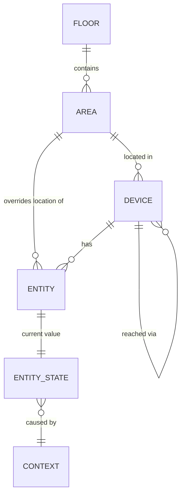

# Spec: entities, registry, and state

Status: **accepted for Phase 0** (M0.2). Changes go through a PR that updates this file, the
types in `crates/irori-types`, the generated `schemas/`, and the examples in `fixtures/types/`
together; CI fails if the last three disagree.

---

## 1. Purpose

This is the vocabulary every other part of Irori speaks: integrations report devices and
state in it, rules read and act on it, the recorder stores it, the API and UI show it, and AI
features generate against it. It has to be:

- **Typed.** A light's brightness is a number from 1 to 255, not "whatever string the
  integration sent". Rules can be checked before they run (ROADMAP D8).
- **Familiar.** Domain names and fields follow Home Assistant where that doesn't cost typing
  (D14), because people and LLMs already know them.
- **Strict at the edges.** Unknown fields and malformed ids are rejected with a message that
  says what's wrong, so mistakes surface when data enters, not three layers later.

## 2. The model at a glance

Two halves, deliberately kept apart:

| | **Registry** (§4) | **State** (§5) |
|---|---|---|
| What | What exists and what it can do | What it's doing right now |
| Types | `Floor`, `Area`, `Device`, `Entity` | `EntityState` |
| Changes | Rarely: pairing a device, renaming, moving rooms | Constantly: every sensor report |
| Stored | Registry tables; user edits in the config dir (M0.7) | In memory; history in the recorder |

Splitting them keeps every state update small, and lets rules be checked against the
registry ("does this light support color temperature?") without looking at live values.

## 3. Identifiers

All ids are case-sensitive strings. Every type validates on construction and when parsed,
and its JSON Schema carries the same rule.

| Type | Format | Example |
|---|---|---|
| Slug ids: `FloorId`, `AreaId`, `DeviceId`, `IntegrationId`, `UserId`, `RuleId`, `TokenId`, `AttributeKey` | `^[a-z0-9]+(_[a-z0-9]+)*$`, 1–64 chars: lowercase letters and digits in words joined by single `_` | `ground_floor` |
| `EntityId` | `<kind>.<object_id>`; `kind` is one of the kinds in §4.4, `object_id` is a slug | `binary_sensor.hallway_motion` |
| `ContextId` | ULID: 26 chars, uppercase Crockford base32, first char `0`–`7` | `01K5B2Q9A1B2C3D4E5F6G7H8J9` |
| `UniqueId` | Opaque, 1–255 chars, no control characters. Chosen by the integration, unique within it | `0x00158d0001a2b3c4` |
| `Name` | 1–100 chars, no leading/trailing whitespace, no control characters. Any language | `Küche · Decke` |

Why these choices:

- **Slugs are strict** (no `-`, no uppercase, no `__`) so ids are safe in file names, URLs,
  expressions, and config keys without escaping, and there's exactly one spelling of each.
- **The entity kind lives in the id.** `light.hallway` can never be a switch, and anything
  holding just an id (a rule, a trace, a log line) knows the kind. The `.` separator matches
  Home Assistant.
- **ULIDs for contexts** sort by creation time, which makes "what caused what" chains easy to
  order. The core generates them from its injected clock (D10); types never read the clock.
- **`id` vs `unique_id`.** `unique_id` is the integration's permanent handle (a Zigbee
  address). `id` is the user-facing name and may change. Pairing a device again or restarting
  maps back to the same entry through `(integration, unique_id)`.

## 4. Registry

JSON field names are `snake_case`. Optional fields may be omitted, and Irori omits them when
writing.

### 4.1 Floor

| Field | Type | Required | Notes |
|---|---|---|---|
| `id` | `FloorId` | yes | |
| `name` | `Name` | yes | |
| `level` | integer −128…127 | yes | Sort order. `0` is the entrance level, negative is below ground |

### 4.2 Area

A room or zone.

| Field | Type | Required | Notes |
|---|---|---|---|
| `id` | `AreaId` | yes | |
| `name` | `Name` | yes | |
| `floor_id` | `FloorId` | no | |

### 4.3 Device

A physical or virtual thing an integration talks to. It has one or more entities.

| Field | Type | Required | Notes |
|---|---|---|---|
| `id` | `DeviceId` | yes | Its **one** id, everywhere. Made once from `integration` and `unique_id` — `esphome_30_83_98_ca_6a_08` — and never from a name, so it never changes (ROADMAP D36) |
| `integration` | `IntegrationId` | yes | The integration that provides it |
| `unique_id` | `UniqueId` | yes | Unique within `integration` |
| `name` | `Name` | yes | Its one name: a person's, else what the integration reports. Never two side by side |
| `description` | `Description` | no | What it's for, in a person's words |
| `manufacturer`, `model`, `sw_version`, `hw_version` | string | no | As reported; informational only |
| `area_id` | `AreaId` | no | |
| `suggested_area` | `Name` | no | The room the device says it's in; used only while no one has placed it ([config.md](config.md) §5) |
| `via_device_id` | `DeviceId` | no | The bridge or coordinator it's reached through |

### 4.4 Entity

One controllable or observable thing, e.g. a device's light, its illuminance sensor, and its
motion sensor are three entities.

| Field | Type | Required | Notes |
|---|---|---|---|
| `id` | `EntityId` | yes | Its kind must match `capabilities.kind`. `<kind>.<device id>_<name the integration gave it>`, or the integration's `suggested_object_id`: never a name a person chose, so no rename leaves an id that says something else |
| `integration` | `IntegrationId` | yes | |
| `unique_id` | `UniqueId` | yes | Unique within `integration`; survives renames of `id` |
| `name` | `Name` | yes | |
| `device_id` | `DeviceId` | no | Entities without a device are allowed (e.g. a computed value) |
| `area_id` | `AreaId` | no | **Overrides** the device's area. Effective area = `entity.area_id` ?? `device.area_id` |
| `capabilities` | object tagged by `kind` | yes | What it can do; see below |

**Kinds in v1:** `light`, `switch`, `sensor`, `binary_sensor`.
**Next, in likely order:** `cover`, `climate`, `button`/`event`, `lock`. Adding a kind is an
additive change: a new tag in `Capabilities` and `State`.

**Capabilities by kind** (static facts; they don't change with state):

| Kind | Field | Type | Default | Meaning |
|---|---|---|---|---|
| `light` | `brightness` | bool | `false` | Dimmable |
| | `color_temp_kelvin` | `{ min, max }`, 1000–20000, `min ≤ max` | absent | Supports color temperature in this range |
| | `rgb` | bool | `false` | Supports RGB color |
| `switch` | `device_class` | `outlet` \| `switch` | absent | |
| `sensor` | `value_type` | `number` \| `text` | **required** | Rules are type-checked against it |
| | `device_class` | `temperature` \| `humidity` \| `illuminance` \| `pressure` \| `power` \| `energy` \| `voltage` \| `current` \| `battery` \| `co2` \| `pm25` \| `signal_strength` | absent | |
| | `unit` | string | absent | E.g. `°C`, `lx`, `%`, `W`, `kWh` |
| | `state_class` | `measurement` \| `total` \| `total_increasing` | absent | How values accumulate, for statistics |
| `binary_sensor` | `device_class` | `motion` \| `occupancy` \| `door` \| `window` \| `moisture` \| `smoke` \| `gas` \| `vibration` \| `plug` \| `connectivity` \| `problem` \| `battery` | absent | Says what `on` means |

Device classes are closed lists: an integration maps what it knows and leaves the rest absent.
New classes are additive.

## 5. State

### 5.1 EntityState

| Field | Type | Required | Notes |
|---|---|---|---|
| `entity_id` | `EntityId` | yes | Its kind must match `state.kind` |
| `availability` | `available` \| `unavailable` | yes | Is the device reachable? |
| `state` | object tagged by `kind`, or `null` | yes, even when `null` | The typed value; `null` means **unknown** |
| `attributes` | map of `AttributeKey` → any JSON | no | Integration extras; see §5.4 |
| `last_changed` | `Timestamp` | yes | `state` or `availability` changed |
| `last_updated` | `Timestamp` | yes | `state`, `availability`, or `attributes` changed |
| `last_reported` | `Timestamp` | yes | The integration last reported anything about it, even an identical value |
| `context` | `Context` | yes | What caused the last change (§6) |

Timestamps are RFC 3339 with an offset, written in UTC (`2026-09-15T22:04:31.12Z`). Always
`last_changed ≤ last_updated`. `last_reported` is what tells a stale sensor (no reports for hours)
from a steady one (same value, reported every minute), so it only moves when the integration says
something. It starts when the entity is registered: describing an entity **is** the integration
telling Irori about it, and an entity that has never reported a value shows that as `state: null`.
So it's never empty. It can be earlier than the other two: when an integration crashes, Irori marks its
entities unavailable without hearing from them, and the page can still say "offline, last heard
from 3 hours ago".

### 5.2 Unknown vs unavailable

These are different questions, so they're different fields:

| Situation | `availability` | `state` |
|---|---|---|
| Normal | `available` | the value |
| Device offline | `unavailable` | **the last known value**, kept |
| Never reported since startup | `available` | `null` |
| Offline and never reported | `unavailable` | `null` |

In Home Assistant both replace the value with a string (`"unavailable"`, `"unknown"`), so the
last value is lost and every numeric comparison must guard against strings. Keeping them
separate means the UI can show "21.5 °C (offline)", and the rules spec (M0.3) decides
explicitly how triggers and conditions treat unavailable entities.

### 5.3 State by kind

All are tagged with `kind`, e.g. `{ "kind": "light", "on": true, "brightness": 153 }`.

| Kind | Field | Type | Required | Notes |
|---|---|---|---|---|
| `light` | `on` | bool | yes | |
| | `brightness` | integer 1–255 | no | Only if dimmable. Kept while off: the level it returns to. `0` is invalid; off is `on: false` |
| | `color_mode` | `color_temp` \| `rgb` | no | Which color setting is active |
| | `color_temp_kelvin` | integer 1000–20000 | no | |
| | `rgb` | `[r, g, b]`, each 0–255 | no | |
| `switch` | `on` | bool | yes | |
| `sensor` | `value` | finite number or string | yes | Must match the entity's `value_type` (checked by the core, which has both) |
| `binary_sensor` | `on` | bool | yes | Meaning depends on `device_class`: motion detected, door open, … |

**Brightness is 1–255**, not a percentage: that's what Zigbee and Home Assistant use, so no
precision is lost converting. Services will accept `brightness_pct` for people (M0.3).

### 5.4 Attributes

A free-form map for integration-specific extras (`linkquality`, `battery_voltage`, …). Keys are
slugs; values are any JSON. Rules may read them, but they're **not type-checked**, so
anything the core or rules rely on must become a typed field instead. Attributes are the
escape hatch, not the model.

## 6. Context

Every state change and service call carries a context, so any change can be traced to its
cause ("the hallway light turned on because rule `hallway_motion_light` run X ran, because
the motion sensor reported at 22:04:12").

| Field | Type | Required | Notes |
|---|---|---|---|
| `id` | `ContextId` | yes | |
| `parent_id` | `ContextId` | no | The context that led to this one |
| `origin` | object tagged by `type` | yes | See below |

| `origin.type` | Fields | Meaning |
|---|---|---|
| `device` | `integration` | Reported by a device, e.g. someone pressed a physical switch |
| `user` | `user_id` | A person, through the UI or CLI |
| `rule` | `rule_id`, `run_id` (ULID) | A rule run; the trace spec (M0.4) defines runs |
| `api` | `token_id` | An API client with an access token |
| `system` | — | Irori itself: restoring state at startup, reloading config |

## 7. Validation

Data is validated in layers. This spec covers the first two; the core adds the third.

1. **JSON Schema** (`schemas/*.schema.json`, draft 2020-12, generated by `cargo xtask schemas`).
   For editors, other languages, and LLM tooling. Covers shapes, enums, id patterns,
   ranges, unknown fields, and the id-kind ↔ tag match.
2. **Rust types** (`irori-types`, also compiled to wasm for the UI). Everything the schema
   checks, plus rules JSON Schema can't express:
   - `min ≤ max` for `color_temp_kelvin`
   - `last_changed ≤ last_updated`

   These examples live in `fixtures/` as `*.schema-allows.json`, so it's explicit which rules
   only Rust enforces.
3. **Against the registry** (the core): a device's `area_id` exists, a state's value matches
   the entity's capabilities (`brightness` only if dimmable, sensor `value` matches
   `value_type`), `unique_id` is unique per integration, `via_device_id` has no cycles.

**Error messages are part of the contract.** They name the field or value and say what's
allowed, e.g. ``entity `light.hallway` is a light, but its state is for a switch``. The
golden examples in `fixtures/types/*/invalid/` pin the expected message for each case, so a
change that makes an error vaguer fails the tests.

**Unknown fields are rejected** everywhere. A typo (`"birghtness"`) fails loudly instead of
being silently ignored. Adding a field is therefore a coordinated change between producers and
consumers; API versioning is part of the API spec (M0.5).

## 8. Not in this spec (on purpose)

| Topic | Where it's decided |
|---|---|
| Services (`light.turn_on` and its parameters) | [Integration contract](integrations.md) §7 (what integrations receive); API and rules specs (how people and rules call them) |
| How rules treat `unavailable` and `null` state | Rules spec (M0.3) |
| Run and trace ids and formats | Trace spec (M0.4) |
| Registry and state over the API | API spec (M0.5) |
| How integrations create and update entries | [Integration contract](integrations.md) §5–§6 |
| How users rename entities or assign areas in files | Config spec (M0.7) |
| Renaming an entity `id` and rewriting rules that use it | Open question 1 |
| Hidden/disabled entities, icons, entity categories | Later, when the UI needs them |
| Unit conversion and preferred units | Later; `unit` is informational for now |

## 9. Changes from the roadmap draft

ROADMAP M0.2 sketched a single `Entity` holding both registry and state fields, with
`Unavailable`/`Unknown` as state values. This spec changes that:

- **Registry and state are separate types** (§2), so state updates stay small and rules can
  be checked against capabilities alone.
- **Availability is its own field and unknown is `null`** (§5.2), so the last known value
  survives an outage.
- **Capabilities are explicit per kind** (§4.4), so "does it support X?" is a registry
  lookup, not a guess from which state fields happen to be present.
- **Context origin gained `system`**, for changes Irori makes itself.

Recorded as D20 in the ROADMAP decision log.

## 10. Open questions

1. **Entity renames.** When a user renames `light.hallway` to `light.hall_ceiling`, should the
   core rewrite rule files (they're the user's plain-text source of truth, D18), keep an alias,
   or refuse while rules reference it? Decide in M0.7 (config) with M0.3 (rules).
2. **Text sensor values.** Should `text` sensors that report from a fixed set (e.g. a
   washing machine program) declare their options in capabilities, so rules can check
   `== 'rinse'` against them? Likely yes; decide with M0.3.
3. **Units.** Free-form strings today. Before AI dashboards and statistics, decide whether to
   restrict units per `device_class` and normalize (e.g. store °C, display °F).
