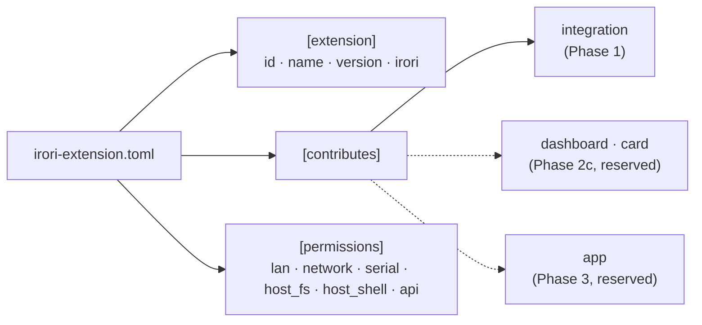
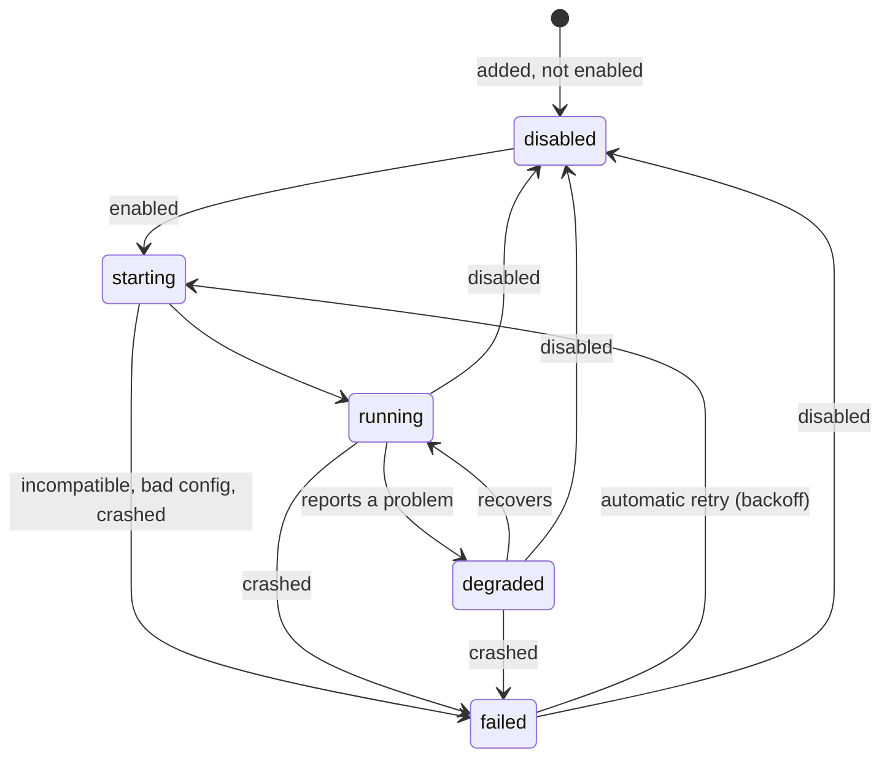

# Spec: extension manifest

Status: **accepted for Phase 0** (M0.6, part A). Changes go through a PR that updates this file,
the types in `crates/irori-types`, the generated `schemas/`, and the examples in
`fixtures/types/` together; CI fails if the last three disagree.

The runtime contract for integrations is in [integrations.md](integrations.md) (part B).

---

## 1. Purpose

Everything beyond the core is an **extension** (ROADMAP D21): the ESPHome integration, a future
SwitchBot connector, a dashboard, a terminal app. An extension is one package with a manifest
that says:

- **who it is:** id, name, version, and which versions of Irori it works with;
- **what it contributes:** an integration now; dashboards, cards, and apps later (D22);
- **what it may access:** the local network, internet hosts, serial ports, files, a shell (D23).

Built-in and external extensions use the same manifest. A built-in one is compiled into the
binary, with its manifest embedded; an external one is a folder with a program in it. From the
UI and CLI they look the same.

## 2. The model at a glance



## 3. The package

```
esphome/
  irori-extension.toml     the manifest (required)
  config.schema.json       JSON Schema for its settings (optional, external extensions)
  bin/esphome              the program (external extensions)
```

The manifest is TOML because people write it by hand. Irori reads it into the JSON data model
and checks it with the same types and JSON Schema (`schemas/extension-manifest.schema.json`)
as everything else, so editors and LLM tooling can validate it too.

How packages are signed, downloaded, and installed from a registry is Phase 3 (ROADMAP §8.1).
In Phase 1, external extensions are added from a local folder (`irori extensions add <path>`).

## 4. Example

```toml
[extension]
id = "switchbot"
name = "SwitchBot"
version = "0.3.0"
irori = ">=0.1.0, <0.2.0"
description = "SwitchBot plugs, meters, and curtains, through the SwitchBot cloud API."
config_schema = "config.schema.json"

[[contributes.integration]]
iot_class = "cloud_polling"
entity_kinds = ["switch", "sensor"]
run = { command = "bin/switchbot" }

[permissions]
network = ["api.switch-bot.com"]
```

More, valid and invalid, in `fixtures/types/extension-manifest/`.

## 5. `[extension]`

| Field | Type | Required | Notes |
|---|---|---|---|
| `id` | slug (`^[a-z0-9]+(_[a-z0-9]+)*$`, 1–64 chars) | yes | Also the id of the integration it contributes (D25), so it appears in `Device.integration` |
| `name` | `Name` | yes | Shown in the UI |
| `version` | version, see below | yes | |
| `irori` | requirement, see below | yes | Which versions of Irori it works with |
| `description` | 1–500 chars, one line | no | |
| `config_schema` | package path | no | JSON Schema (draft 2020-12) for its settings. External extensions only: a built-in extension's schema is generated from its Rust config type |
| `icon` | package path | no | A square SVG shown beside the extension and its devices. Always displayed as an image (``, served with a no-script content policy), never inlined into a page. A built-in extension embeds the same file (`Integration::ICON`), and the two must agree |

**Versions** are [Semantic Versioning](https://semver.org) `MAJOR.MINOR.PATCH` with an optional
pre-release: `1.4.0`, `0.3.0-beta.1`. No build metadata (`+abc`), so two equal versions are
always spelled the same. Each number has at most 9 digits; at most 64 characters in total.

**The `irori` requirement** is `>=A.B.C`, or `>=A.B.C, <X.Y.Z` with the upper bound above the
lower. That's all: one way to write each range, and nothing to misread. Before 1.0, minor
versions may break extensions, so extensions should cap the next minor (`>=0.1.0, <0.2.0`). A
pre-release of Irori counts as its release: `0.2.0-dev` satisfies `>=0.2.0`.

An extension whose requirement doesn't match the running Irori isn't started; it shows as
`failed` with the reason, e.g. `requires Irori >=0.2.0, this is 0.1.0`.

**Package paths** (`config_schema`, `run.command`) are relative to the package root: `/`-separated
names of letters, digits, `.`, `_`, `-`, where no name starts with `.`. So a path can't point
outside the package, and there are no hidden files.

## 6. `[contributes]`

One list per contribution kind, written as TOML arrays of tables (`[[contributes.integration]]`).

| Kind | Status | What it is |
|---|---|---|
| `integration` | **Phase 1**, specified below and in [integrations.md](integrations.md) | Brings in devices and entities: a protocol (ESPHome, MQTT, Zigbee) or a vendor API |
| `dashboard` | Reserved for Phase 2c (ROADMAP §6.4) | A pre-built view that binds to matching devices |
| `card` | Reserved for Phase 2c | A visualization used inside dashboards |
| `app` | Reserved for Phase 3 (ROADMAP §8.2) | A tool with its own page, served by the extension |
| `automation` | Reserved | An automation engine. The core does not ship one; engines are installed as extensions. This version reads the contribution and ignores it with a warning, like dashboard/card. |

### 6.1 Integration

| Field | Type | Required | Notes |
|---|---|---|---|
| `iot_class` | `local_push` \| `local_polling` \| `cloud_push` \| `cloud_polling` | yes | Shown as a badge; `cloud_*` means it needs the internet (D24) |
| `entity_kinds` | list of entity kinds, at least one, no repeats | yes | The kinds it creates. It must handle the standard services of each ([integrations.md](integrations.md) §6) |
| `run` | `{ command = <package path>, args = [<string>…] }` | external only | How the core starts it. Built-in extensions leave it out |

**At most one integration per extension** in this version (D25). The integration's id is the
extension id.

### 6.2 Kinds this version doesn't implement

An extension may contribute kinds a given Irori doesn't implement: the reserved ones above, or
kinds added in a later Irori. This version **reads them, ignores them, and shows a warning**
(`contributes.dashboard isn't supported by this version of Irori yet; ignoring it`); they're
never an error. So an extension can ship a dashboard for newer Irori and still provide its
integration on older ones.

They must still be lists of tables. Their fields aren't checked until the version that
implements them.

**Everything else unknown is an error.** An unknown field in `[extension]`, `[permissions]`, or
an integration entry, or an unknown top-level table, is almost always a typo, so it fails loudly.
A manifest that needs a newer Irori for such a field says so in `irori`.

## 7. `[permissions]`

Everything defaults to no access. The owner sees the list when adding the extension, and any
increase on update needs approval again (D23).

| Field | Type | Grants |
|---|---|---|
| `lan` | bool | Devices on the local network: private and link-local addresses, and mDNS (`.local` names, service discovery) |
| `network` | list of hosts, no repeats | These internet hosts. A lowercase hostname with a domain (`api.switch-bot.com`), or `*.example.com` for every subdomain. Not IP addresses or local-network names (`.local`, `.home.arpa`, `.internal`, `.lan`, `.home`), which need `lan`, so local access can't hide behind this permission |
| `serial` | list of `/dev/…` paths, no repeats | These serial or USB devices, e.g. `/dev/ttyUSB0` |
| `host_fs` | list of paths, no repeats | These files and folders. `$CONFIG` and `$DATA` (optionally `/sub/path`) are Irori's own folders; any absolute path (`/`, `/home/pi`) is outside them |
| `host_shell` | bool | Running commands on the machine |
| `api` | list of scopes, no repeats | Irori API access beyond its own devices: `registry:read`, `states:read`, `events:read`, `services:call` |

**No permission is needed** for what every integration does: creating and updating its own
devices and entities, reporting their state, and handling service calls for them.

**Full access.** `host_shell = true`, or any `host_fs` path outside `$CONFIG` and `$DATA`, means
the extension can do anything on the machine. The UI and CLI must say that in those words, and
only the owner can approve it. A terminal app is honest about what it is instead of hiding it.

**Enforcement.** In Phase 1, API scopes are enforced on the extension's token. `lan`, `network`,
`serial`, and host access are recorded, shown, and approved, but only enforced where the OS
makes it practical (ROADMAP M1.5). The UI must not suggest otherwise. When `network` is enforced,
it has to check the addresses a name resolves to as well: a public-looking name can point at a
local address.

## 8. Lifecycle

What the UI and CLI show for each extension and each of its contributions:



| State | Meaning | Reason shown |
|---|---|---|
| `disabled` | Turned off in `irori.toml` (`[extensions] disabled`) | — |
| `starting` | Being set up | — |
| `running` | Working | — |
| `degraded` | Working, with a problem it reported, e.g. one of four devices unreachable | The integration's own message |
| `failed` | Not working | Why, e.g. `requires Irori >=0.2.0`, an invalid setting, or the crash; plus when the next retry is |

An extension's state is the worst of its contributions'. Supervision and retries are in
[integrations.md](integrations.md) §3.

## 9. Validation

Same layers as [entities.md](entities.md) §7:

1. **JSON Schema** (`schemas/extension-manifest.schema.json`): shapes, patterns, enums, unknown
   fields, at most one integration, no repeated list items.
2. **Rust types** (`irori-types`): everything above, plus what JSON Schema can't express: the
   `irori` upper bound must be above the lower (`*.schema-allows.toml` in the fixtures).
   `description` is one line: no control characters and no Unicode line or paragraph separators.
3. **When loading** (the core's extension host): the `irori` requirement matches this version;
   built-in extensions have no `run`, external ones do; `config_schema` exists and is a valid
   schema; the id isn't taken by another extension.

Warnings for ignored contribution kinds come from layer 2 (`ExtensionManifest::warnings`).

## 10. Not in this spec (on purpose)

| Topic | Where it's decided |
|---|---|
| Integration lifecycle, services, and messages | [integrations.md](integrations.md) |
| Turning extensions off, and where their settings live | [config.md](config.md) §3.4–3.5. Approved permissions: planned for `extensions/<id>.toml` |
| Signing, registry index, `install`/`update` | Phase 3 (ROADMAP §8.1) |
| Dashboard, card, and app fields | The phases that build them (§6) |
| Namespaced ids (`author.switchbot`) | ROADMAP open question 12, before the registry opens |
| Icons, homepage, author, license | Later, when the Extensions page needs them |

## 11. Changes from the roadmap draft

ROADMAP M0.6 sketched the manifest. This spec changes it:

- **`services` is gone from the integration entry.** Declaring `entity_kinds` already says which
  standard services it handles ([integrations.md](integrations.md) §6). Custom services are an
  open question there.
- **`lan` is its own permission**, separate from `network`. Local devices (ESPHome, Hue bridges)
  have addresses the author can't know in advance, and "on your network" versus "on the internet"
  is the distinction the owner cares about.
- **`irori` is written in full**, `>=0.1.0` rather than `>=0.4`, and only as `>=` with an
  optional `<`.

## 12. Open questions

1. **Reserved ids.** Should ids like `irori`, `core`, or `system` be reserved, so an extension
   can't look like part of Irori in logs and contexts? Likely yes; decide in M1.1.
2. **Permission granularity for `lan`.** Is "the whole local network" enough, or should an
   extension be able to ask for a subnet or specific addresses? Revisit when enforcement exists.
