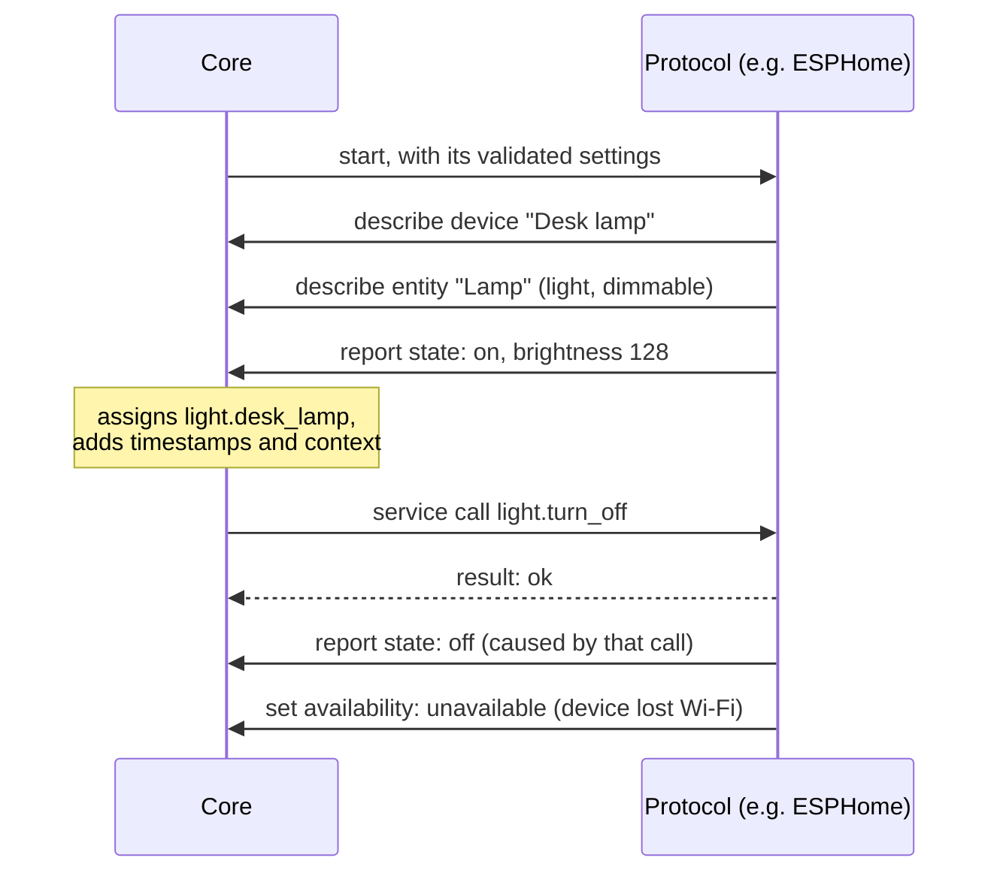

# Spec: protocol contract

Status: **accepted for Phase 0** (M0.6, part B). Changes go through a PR that updates this file,
the types in `crates/irori-types`, the generated `schemas/`, and the examples in
`fixtures/types/` together; CI fails if the last three disagree.

How a protocol is packaged and declared is in [extensions.md](extensions.md) (part A). The
vocabulary it speaks (devices, entities, state, context) is in [entities.md](entities.md).

---

## 1. Purpose

A protocol brings devices into Irori: ESPHome boards, MQTT devices, a cloud API. This spec
is the **one contract** every protocol follows, built-in (Rust, in the binary) or external
(any language, its own process) (ROADMAP D15, D16). It has to be:

- **Enough.** ESPHome, MQTT, and cloud APIs must fit without special cases in the core. If one
  doesn't fit, the contract changes, never the core.
- **Safe for the core.** A crashing, slow, or misbehaving protocol can't take down the core or
  other protocols, or corrupt the registry.
- **Small.** A protocol author learns a handful of operations, not the core's internals.

## 2. At a glance



The protocol only ever speaks in **its own ids** (`unique_id`). The core owns everything else:
the user-facing ids, timestamps, contexts, history, and checking that what it's told makes sense.

## 3. Lifecycle and supervision

1. **Start.** The core takes the protocol's settings — its table in `secrets.toml`
   ([config.md](config.md) §3.4) — checks them against its config type, and starts it with them.
   Invalid settings mean `failed` with the error and no retry, until the settings change.
   **The error must not quote a value**: settings are where secrets live, and the reason is
   logged and shown.
2. **Running.** The protocol connects to its devices, describes them, reports state, and
   handles service calls until it's told to stop.
3. **Stop.** When disabled or when Irori shuts down, the protocol is told to stop and has
   **5 seconds** to return. After that its task is cancelled, or its process killed.
4. **Crash.** A panic, an error returned from `run`, or an exiting process marks it `failed`.
   All its entities become `unavailable` and keep their last value. The core starts it again
   after 1 s, then 2 s, 4 s, … up to 5 minutes between attempts; the delay resets after
   10 minutes of running.
5. **Restart.** A restarted protocol describes its devices and entities again. The registry
   keeps them in between, matched by `unique_id`, so ids, areas, and names the user set survive.
   Nothing is removed unless the protocol removes it (§5).
6. **New settings.** When a protocol's own settings change, the core stops it (with the same
   5-second grace) and starts it again with the new ones straight away: no backoff, because it
   didn't fail. A change to another protocol's settings doesn't touch it. A protocol never
   reloads settings itself; restarting is the one way they arrive, so there is exactly one code
   path to get right.

**Isolation.** Built-in protocols run in their own task, and **must never block**: no
long computation, blocking I/O, or `std::thread::sleep`, in `run` or before it returns its
future. Blocking one task blocks a shared worker, which no supervision can undo, so slow or
blocking work belongs in `tokio::task::spawn_blocking` or its own thread. This is a rule rather
than a guarantee because built-in protocols are first-party code, shipped and reviewed with
the core; anyone else's code runs as a separate process, where the operating system enforces the
boundary. Revisit if third-party code is ever allowed in-process (ROADMAP open question 7).

The core never waits on a protocol while holding its own state: operations reach the core
through bounded queues;
state reports for the same entity are merged so only the latest waits in line, and at most 4096
entities' reports wait at once (further ones are dropped and logged); service calls time out
after **10 seconds**. A panic while the protocol is starting counts as a crash. Third-party code only runs as an external process, never in the
core's process.

## 4. Identity

- The protocol names each device and entity with a `unique_id` it chooses and **never
  changes**: a MAC address, a Zigbee IEEE address, a cloud API's device id. It must be unique
  within the protocol.
- The core assigns the ids people see. A `DeviceId` is the protocol id and `unique_id` as a
  slug, and an `EntityId` builds on its device's id (or on `suggested_object_id`) — never on a name
  a person chose ([entities.md](entities.md) §4.3). People rename devices and entities; the
  protocol never notices, because it keeps using `unique_id`.
- The protocol id is the extension id (D25). Every device and entity it describes gets
  `protocol = <its id>`; it can't describe entries for another protocol.

## 5. Operations

**What a protocol can do:**

| Operation | Data | Notes |
|---|---|---|
| Describe a device | `DeviceDescription` (§6.1) | Adds it, or updates the one with the same `unique_id` |
| Describe an entity | `EntityDescription` (§6.2) | Same. Its device must be described first |
| Remove a device | `unique_id` | Also removes its entities |
| Remove an entity | `unique_id` | |
| Report state | `StateReport` (§6.3) | A new value for one of its entities |
| Set availability | entity `unique_id`s, or a device `unique_id` for all its entities; `available` \| `unavailable` | §6.4 |
| Set health | `running`, or `degraded` with a reason | §6.5 |
| Set waiting | what it found but can't use until a person helps, replacing the last list | §6.6 |
| Handle service calls | receives `ServiceCall` (§7), replies with a result | For its own entities only |
| Store small data | key (1–128 characters) → JSON value, up to 64 KB each; load, store, forget | Private to the protocol, kept across restarts of it and of Irori, in the data directory's database. E.g. pairing keys, a cloud token refresh, the value a helper was left at. Not for settings (a person's decisions go in the config directory) and not for history |
| Log | leveled, structured log lines | Tagged with the protocol id |

**Where an external protocol may keep files.** Its working directory is its own package
directory, which uninstalling deletes whole — right for a manifest and a binary, wrong for
anything underneath them. So the host also gives it `IRORI_EXTENSION_DATA`: an absolute path to
`$DATA/extension-data/<id>`, created before the process starts, for what has to outlive the
package. Zigbee is the case that makes this matter — Zigbee2MQTT's network key and pairing table
live in a directory of its own, and losing them strands every paired device — and an upgrade
today *is* an uninstall and a reinstall. Small values belong in the storage above instead; this
is for a subprocess's own files, which Irori can't hold for it.

**What it can't do:** see or change other protocols' devices and entities (without the `api`
permissions, [extensions.md](extensions.md) §7), touch rules, write history, or set timestamps and
contexts itself.

## 6. Messages from the protocol

JSON field names are `snake_case`; optional fields may be omitted. Unknown fields are rejected.
Schemas: `schemas/device-description.schema.json`, `entity-description`, `state-report`.

### 6.1 DeviceDescription

| Field | Type | Required | Notes |
|---|---|---|---|
| `unique_id` | `UniqueId` | yes | |
| `name` | `Name` | yes | Updated each time the device is described. Once people can rename devices (config spec, M0.7), a name they set wins |
| `manufacturer`, `model`, `sw_version`, `hw_version` | string | no | Informational, updated every time |
| `suggested_area` | `Name` | no | An area name the device reports for itself (ESPHome's `area`). Used only when the device is new and has no area; the core matches it to an existing area by name |
| `via_device_unique_id` | `UniqueId` | no | The bridge or hub it's reached through. Not its own `unique_id` |

### 6.2 EntityDescription

| Field | Type | Required | Notes |
|---|---|---|---|
| `unique_id` | `UniqueId` | yes | |
| `name` | `Name` | if no device | Leave out for a device's main feature (a smart plug's relay): it then uses the device's name |
| `device_unique_id` | `UniqueId` | if no name | The device it belongs to |
| `suggested_object_id` | slug | no | The part after `.` in its entity id, when it's new. Otherwise derived from the names |
| `capabilities` | `Capabilities` ([entities.md](entities.md) §4.4) | yes | `capabilities.kind` is the entity's kind, and must be one of the manifest's `entity_kinds` |

Describing an existing entity again updates its name and capabilities (a nameless entity follows
its device's name); it never changes its kind or its id. A different kind needs a different
`unique_id`. If the new capabilities no longer fit the stored value, the value is forgotten
(`null`) until the next report.

### 6.3 StateReport

| Field | Type | Required | Notes |
|---|---|---|---|
| `unique_id` | `UniqueId` | yes | |
| `state` | `State` ([entities.md](entities.md) §5.3), or `null` | yes, even when `null` | `null` when the device doesn't know (e.g. it just rebooted) |
| `attributes` | map of `AttributeKey` → any JSON | no | Replaces all attributes; leave out to clear them |
| `caused_by` | `ContextId` | no | The context of the service call this change answers |

The core turns a report into the entity's `EntityState`: it sets `last_reported`, updates
`last_changed` and `last_updated` if something changed, and sets the context:

- with `caused_by`: a new context whose `parent_id` is that call's context, so "the lamp turned
  off because rule X ran" is traceable;
- without: a new context with `origin: device`.

Report what the device says, when it says it. A protocol shouldn't report a value it only
asked for (optimistic state) unless the device can't report back; see open question 2.

### 6.4 Availability

Separate from state (ROADMAP D20). Describing an entity marks it `available`: the protocol is
in touch with it, whether it's new or described again after a restart. When a device drops off the
network, set it `unavailable` (per device, or per entity); the last value stays. Setting the same
availability again counts as hearing from the device (it moves `last_reported`); the core marking
entities unavailable after a crash doesn't, so "last heard from" stays true. When the
protocol itself stops or crashes, the core marks all its entities `unavailable`.

### 6.5 Health

What the protocol says about itself, shown on the Extensions page:

- `running`: everything's fine.
- `degraded` + reason: working, with a problem worth showing. For example `2 of 5 devices
  unreachable`, or `3 entities skipped: kinds not supported yet (select, number)`.

`starting`, `failed`, and `disabled` are set by the core ([extensions.md](extensions.md) §8).

### 6.6 Waiting

Something the protocol has found and can't use until a person does something: a device that
wants an encryption key, one that has to be paired, an account to sign in to. The protocol
sends the **whole list** whenever it changes (an empty list when nothing waits), and the core
shows it with the extension. It is cleared whenever the protocol stops, because a list from a
stopped protocol is out of date.

| Field | Type | Required | Notes |
|---|---|---|---|
| `unique_id` | `UniqueId` | yes | The handle the device will have once it's in the registry, so what a person provides now stays attached to it (ROADMAP D31) |
| `name` | `Name` | yes | What it announced itself as |
| `reason` | string | yes | What's needed, in a sentence: `it wants an encryption key`, `the encryption key doesn't match` |
| `secret` | `{ path, label, hint? }` | no | Where a secret that would unlock it goes |

Waiting items are **not** devices in the registry. Nothing is known about them beyond what they
announced, and a device with no entities that can't do anything is worse to show than a clear
"found, needs a key".

**Secrets.** `secret.path` is a list of table keys inside the protocol's own table in
`secrets.toml`, e.g. `["keys", "00:11:22:33:44:55"]`. The UI can take a secret for any
protocol without knowing what it means, and the core writes it to exactly that place. The
core accepts a secret **only at a path the protocol is currently asking for**: until there is
sign-in (ROADMAP D12), an endpoint that wrote anything anywhere would let anyone on the network
rewrite anyone's settings. A secret, once given, is never sent back, and the protocol receives
it on its next start (§3, step 6).

## 7. Service calls

### 7.1 Standard services

Each entity kind has standard services. A protocol handles the ones for every kind in its
manifest's `entity_kinds`.

| Service | `data` | Notes |
|---|---|---|
| `light.turn_on` | `brightness` 1–255, `color_temp_kelvin` 1000–20000, `rgb` `[r, g, b]`; all optional; not both color settings | No data: on at its last brightness and color |
| `light.turn_off` | none | |
| `switch.turn_on` | none | |
| `switch.turn_off` | none | |

`sensor` and `binary_sensor` have no services.

**What the core resolves first,** so protocols don't have to:

- **Toggle.** People and rules can call `light.toggle`; the core reads the current state and
  sends `turn_on` or `turn_off`. Until the device reports back, the core remembers what it last
  told the entity to be and resolves the next toggle against that, so two toggles at once cancel
  out instead of both doing the same thing. That memory is cleared when the device reports, and
  whenever a call doesn't reach the protocol or comes back failed: an error, a timeout, a
  dropped call, or a caller who gives up before delivery. A caller who gives up *after* delivery
  leaves it in place, because the protocol has the call and its report is still coming.

  Calls on one entity are also handled one at a time, but that's ordering, not a guarantee: a
  caller who gives up mid-call releases its turn while the protocol may still be working, so
  two commands can briefly overlap at the device. Correctness rests on the remembered command
  above, not on the ordering.
- **Friendlier parameters.** `brightness_pct` from people becomes `brightness`.
- **Capabilities.** A call asking for something the entity can't do (brightness on a
  non-dimmable light, a color temperature outside its range) is rejected before it reaches the
  protocol.

### 7.2 ServiceCall

What the protocol receives. Schema: `schemas/service-call.schema.json`.

| Field | Type | Notes |
|---|---|---|
| `service` | service name (§7.1) | |
| `unique_id` | `UniqueId` | Which entity, in the protocol's terms |
| `data` | object | The service's data; left out when empty |
| `context` | `Context` | Why it's being called. Pass `context.id` back as `caused_by` when reporting the result |

There's deliberately no `entity_id`: that's the user's name for the entity and can change at any
time (§4). The core has already checked that the entity belongs to this protocol, is of the
service's kind, and can do what's asked, and it checks again right before sending, in case the
protocol changed the entity meanwhile. A change in the last moment still reaches the
protocol, which answers with an error like any other device trouble (§7.3): the core never
holds the registry while waiting on a protocol (§3).

### 7.3 Result

The protocol replies once per call, **after the device accepted the command** (not after the
new state is confirmed; that comes as a state report):

- `ok`
- `error` with a code and a message for people:
  - `unavailable`: the device can't be reached right now;
  - `failed`: the device or service refused or failed, e.g. the cloud API returned an error.

The core adds `timeout` when there's no reply within 10 seconds. Errors go back to whoever made
the call (the UI, the CLI, a rule's trace).

## 8. What the core checks

Beyond the types (layer 2), the core checks every operation against the registry and the
manifest (layer 3), and rejects it with a message naming the problem:

- an entity's kind is in the manifest's `entity_kinds`;
- `device_unique_id` and `via_device_unique_id` refer to devices this protocol described;
  `via` chains have no cycles;
- an entity isn't re-described with a different kind;
- a state report's kind matches the entity's, and fits its capabilities (`brightness` only if
  dimmable, a sensor value matching `value_type`);
- `caused_by` is the context of a call delivered to this protocol in the last 5 minutes (the
  core remembers up to 1024 per protocol).

A rejected describe returns the error to the protocol. A rejected state report is logged and
dropped, and the Extensions page shows how many were rejected.

## 9. Built-in protocols (Rust)

Built-in protocols implement a trait from the SDK (`irori-protocol`). Roughly:

```rust
pub trait Protocol: Send + 'static {
    /// Its settings. The config schema is generated from this type.
    type Config: DeserializeOwned + JsonSchema + Send;

    /// The manifest, e.g. `include_str!("../irori-extension.toml")`.
    const MANIFEST: &'static str;

    /// Runs until told to stop. Returning an error, or panicking, marks it failed.
    fn run(
        config: Self::Config,
        ctx: ProtocolContext,
    ) -> impl Future<Output = Result<(), ProtocolError>> + Send;
}
```

`ProtocolContext` offers exactly the operations in §5 and nothing else. Service calls arrive
through it, and it ends when the protocol should stop:

```rust
async fn run(config: Config, mut ctx: ProtocolContext) -> Result<(), ProtocolError> {
    let mut lamp = connect(&config.address).await?;
    ctx.describe_device(lamp.device()).await?;
    ctx.describe_entity(lamp.entity()).await?;
    loop {
        tokio::select! {
            call = ctx.next_call() => match call {
                Some(call) => call.reply(lamp.apply(&call.service).await),
                None => return Ok(()), // told to stop
            },
            update = lamp.next_update() => ctx.report_state(update?),
        }
    }
}
```

The exact API is settled in M1.1, with `extensions/demo` as the reference protocol to copy.

## 10. External protocols

External protocols are separate processes, in any language. They do the **same operations**,
as JSON messages over a connection to the core, with the payloads defined in §6–§7:

| Direction | Message | Payload |
|---|---|---|
| → core | `protocol/hello` | extension id, version, and its token |
| ← core | `protocol/welcome` | its settings |
| → core | `device/describe`, `entity/describe` | `DeviceDescription`, `EntityDescription` |
| → core | `device/remove`, `entity/remove` | `unique_id` |
| → core | `state/report` | `StateReport` |
| → core | `availability/set` | `unique_id`s or a device `unique_id`; `available` \| `unavailable` |
| → core | `health/set` | `running` \| `degraded` + reason |
| ← core | `service/call` | `ServiceCall` |
| → core | `service/result` | `ok` \| `error` + code + message |
| → core | `store/get`, `store/set` | key, JSON value |
| → core | `log` | level, message, fields |

The core starts the process from the manifest's `run` and supervises it like a built-in one (§3).
The message envelope, the transport (WebSocket, and maybe a Unix socket: ROADMAP open question 6),
and the token handshake are specified with the API (M0.5) and built in M1.5. Built-in and external
protocols must be indistinguishable from the UI and CLI.

## 11. Not in this spec (on purpose)

| Topic | Where it's decided |
|---|---|
| Where settings live, and hot reload | [config.md](config.md) |
| Settings that aren't secret (`extensions/<id>.toml`) | [config.md](config.md) §7, when a protocol needs one |
| How people call services, including `toggle` and `brightness_pct` | API spec (M0.5) and rules spec (M0.3) |
| Message envelope, transport, and tokens for external protocols | API spec (M0.5), M1.5 |
| Entity kinds beyond v1 (cover, button, select, …) | Additive changes to [entities.md](entities.md) §4.4, as protocols need them |
| Discovery (mDNS, HA MQTT Discovery) | Inside each protocol; the contract only sees the resulting descriptions |

## 12. Changes from the roadmap draft

ROADMAP M0.6 sketched a trait with `setup`, `run(&mut self)`, and `handle_service(&self)`. This
spec changes that:

- **Service calls arrive through the context**, not a separate trait method. With `run` holding
  `&mut self` for as long as the protocol runs, `handle_service(&self)` couldn't be called at
  the same time without every protocol adding locks. One message loop is simpler, and it's
  exactly how external protocols work.
- **`setup` is folded into `run`.** The core checks settings before starting; a restart simply
  calls `run` again.
- **Protocols use `unique_id`s; the core assigns ids.** So users can rename entities without
  the protocol knowing, and a restarted protocol maps back to the same entries.
- **The manifest is the TOML file**, embedded with `include_str!`, instead of a `manifest()`
  method, so built-in and external extensions share one format.
- **Operations are named** (`describe`, `report`, `set availability`) and have typed payloads
  with schemas and golden examples.

## 13. Open questions

1. **Custom services and events.** ESPHome devices have buttons and can fire events; cloud APIs
   have actions like "reboot". Options: new entity kinds (`button`, `event`, already next in
   [entities.md](entities.md) §4.4), or custom services under the protocol's id
   (`esphome.reboot`). Decide with the ESPHome protocol, before rules (M0.3) need them.
2. **Optimistic state.** For devices that can't report back (some IR or 433 MHz ones), should the
   protocol report the requested state, flagged as assumed? Decide when the first such
   device appears.
3. **Native toggle.** Some devices toggle atomically; resolving toggle in the core can race with
   a physical button press. Pass `toggle` through when an entity declares it supports it?
4. **Unsupported entities.** When a device has entities of kinds Irori doesn't have yet, should
   the protocol only mention them in its health, or describe them so the Devices page can list
   "not supported yet"? The second makes gaps visible, which matters while testing in real homes.
