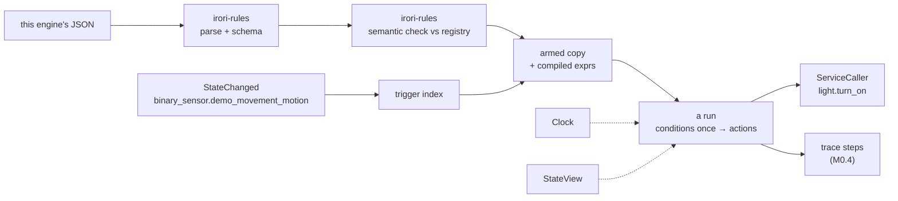
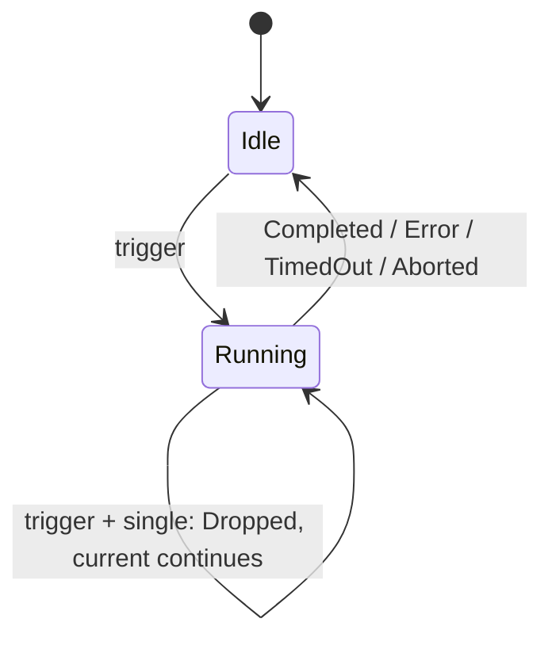
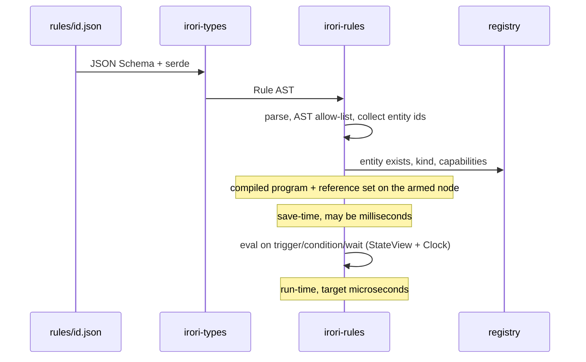
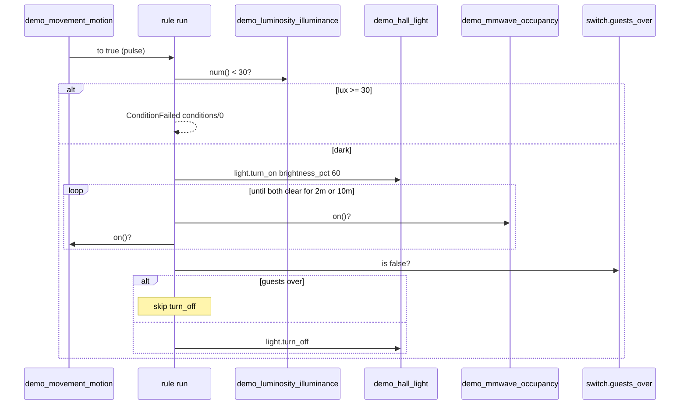

# Spec: sequential automation engine

Status: **draft for Phase 0** (M0.3). This document is the **first-party sequential engine**, not
the Irori OS. The core does not ship an engine, does not load `rules/*.json`, and does not run
automations. This engine will be **downloadable and installable** as an extension
(`[[contributes.automation]]`). Until that host exists, the crate `irori-rules` is a library:
JSON shape, CEL expressions, save-time type-check.

The schema, modes, unavailable/unknown treatment, node paths, and validation layers are written
to be accepted as-is. The expression **surface** is CEL (`cel` 0.14.5 — D41). Changes go through
a PR that updates this file, `crates/irori-rules`, `schemas/rule.schema.json`, and
`fixtures/types/rule/` together; CI fails if those disagree.

The engine that *waits and calls services* is later, still in this crate / extension, not in
`irori-core`.

---

## 1. Purpose

This is how the home starts doing things on its own: a person writes "when the hallway sees
motion and it's dark, turn on the light" as a JSON file, Irori checks it against the real
devices in the house, and then it runs — the same file whether it was typed by hand, saved from
the UI, or drafted by an LLM (ROADMAP D8, D18).

It has to be:

- **Closed and typed.** A rule is a document of tagged nodes, plus a small expression language
  for the comparisons a schema can't hold (`num('sensor.demo_luminosity_illuminance') < 30`). No
  templates, no Python, no Jinja. If a field isn't in this spec, it isn't in a rule.
- **Checked against the home.** Saving a rule that names `light.nope`, asks a non-dimmable light
  for brightness, or calls `num()` on a binary sensor is an error *now*, with a message that
  names the node and what's allowed — not a silent no-op at 22:04.
- **Deterministic.** The engine never reads the wall clock or the live store directly (D10). A
  `Clock`, a `StateView`, and a `ServiceCaller` are injected, so tests and later replay (Phase 2)
  drive it with the same API the core uses.
- **Familiar where that doesn't cost typing.** Services are `light.turn_on` (D14). Brightness in
  state is 1–255; people and rules may write `brightness_pct` and the core turns it into
  brightness before the integration sees the call ([integrations.md](integrations.md) §7.1).

---

## 2. Key Decisions

| # | Decision | Rationale |
|---|---|---|
| K1 | **JSON files, one rule per file**, owned by **this engine** when it is installed — not by the core. Filename equals `id`. | The OS config dir has no `rules/` ([config.md](config.md)). Other engines pick their own files. |
| K2 | **Closed tagged schema + a small expression language.** No templates. | D8. The advantage is validation against the registry, not "JSON vs YAML". |
| K3 | **Author-facing expressions are an Irori function surface** (`num`, `on`, `available`, …). The engine behind it is **CEL** (`cel` 0.14.5, D41). Fallback: a tiny custom evaluator of the same surface if Pi 4 or wasm later kills CEL. | ROADMAP §2.2 named `cel-interpreter`; the same project now publishes as `cel`. The M0.8 spike compiled and eval'd the hallway condition; the surface did not change. |
| K4 | **Expressions type-check at save/load** against the registry (entity exists, kind supports the function). They **evaluate** at run time against `StateView`. Compile once; eval is the µs path. | D8. Parse errors and "that's a switch, not a sensor" are authoring bugs. Unavailable/null are runtime. |
| K5 | **Unavailable and unknown never silently count as a value.** `num()` / `on()` / `text()` require `available` and a non-null state; otherwise the expr errors and the condition is false. State **triggers** fire on typed-value changes only, and only while available. `for` resets if the entity becomes unavailable. Last-known is for the UI, not for automations. | [entities.md](entities.md) §5.2 left this to M0.3. Using last-known while a sensor is offline would turn lights on from a three-hour-old lux reading. |
| K6 | **Top-level conditions run once**, after the trigger and before the first action. They are not re-checked after a wait. Re-check with an `if` on the later action (the guests-over helper lives there). | HA's most common hallway footgun, documented rather than papered over. |
| K7 | **Modes: `single` (default), `restart`, `queued(max)`, `parallel(max)`.** `max` is required and capped at 32. Restart is what the hallway rule wants: a new motion pulse aborts the wait and starts again. | Unbounded parallel on a Pi 4 is how a chatty PIR takes the box down. |
| K8 | **In-flight service calls are not cancelled** when a run is superseded or aborted. Waits and delays are. | The integration may already have the call ([integrations.md](integrations.md) §7). Cancelling after delivery is a race the core refuses to pretend it won. |
| K9 | **Wait timeout continues the run** by default (`on_timeout: "continue"`). Service-call failure **stops** the run (`on_error: "stop"`). | After 10 minutes of occupancy the hallway light should still go off. A failed `turn_on` should not walk into `turn_off`. |
| K10 | **Node path = location in the tree** (`triggers/0`, `actions/2/then/0`). Rule version = SHA-256 of canonical JSON of the definition, **excluding `enabled`**. Traces (M0.4) key `(rule_id, rule_version, node_path)`. | Inserting a node shifts later paths; old traces still match because they point at a version. Toggling enabled must not fork that history. |
| K11 | **People-facing service data** (`brightness_pct`, `light.toggle`) lives on the rule. The core adapter converts to `Command` / `LightTurnOn` (`brightness` 1–255, toggle resolved). Integrations never see `brightness_pct` (already true: `fixtures/types/service-call/invalid/brightness_pct_is_for_people.json`). | entities.md §5.3, integrations.md §7.1. |
| K12 | **Helpers are ordinary switch entities.** `switch.guests_over` is the first real condition. No special helper node. | D40. The helpers extension is already the proof that the integration contract is enough. |
| K13 | **Two gates.** `time` triggers, time-window conditions, `hour()`, `minute()`: unarmed until `irori.toml` has an IANA timezone. `sun` triggers/conditions: unarmed until it has timezone **and** lat/lon. | Civil `07:00` needs a zone. Sunrise needs coordinates. [config.md](config.md) §7 reserves location as one hole; this spec must not arm sun on timezone alone. |
| K14 | **No protocol in the rule schema.** An event trigger names an event (`mqtt.message`); it does not name an MQTT topic as a core field. The MQTT integration (when it emits events) owns topics. | D15. The integration contract today has no "emit event" operation; this spec defines the rule side and a core `Event::Bus` shape. Wiring integrations onto it is a small addendum to integrations.md when MQTT needs it. |
| K15 | **No auth model for rules.** A rule calling `light.turn_off` is the same as the owner doing it in the UI. | D12 is not built. Rules are owner-authored config on disk. |
| K16 | **`irori-rules` is this engine, not the OS.** It depends only on workspace crate `irori-types` among workspace crates. It is **not** a dependency of `irori` / `irori-core`. Traits `Clock`, `StateView`, `ServiceCaller` live here; a future extension host provides the adapter. `cel` 0.14.5 with **`default-features = false`**. | `xtask/src/deps.rs`. |

---

## 3. At a glance



A rule is a small program with four parts:

| Part | When it runs | Example |
|---|---|---|
| **Triggers** | Edge: something just happened | PIR went to `on` |
| **Conditions** | Once, at the start of the run | lux is below 30 |
| **Actions** | In order, after conditions pass | turn on, wait, maybe turn off |
| **Mode** | When a trigger fires while a run is already going | `restart`: abort the wait, start again |

PIR and occupancy are different sensors and stay that way. A good hallway rule **triggers on
motion** (short pulses) and **waits on occupancy** (lingers), optionally also requiring the PIR
to be clear. Treating them as the same bit is how lights cut out while someone is standing still.

---

## 4. What a rule file is

```
config/
  irori.toml
  areas.toml
  devices.toml
  entities.toml
  secrets.toml
  extensions/
    helpers.toml          # [toggles.guests_over] → switch.guests_over
  rules/
    hallway_motion_light.json
```

JSON field names are `snake_case`. Optional fields may be omitted; Irori omits them when writing.
Unknown fields are rejected. A missing `rules/` directory means no rules.

### 4.1 Top-level fields

| Field | Type | Required | Default | Notes |
|---|---|---|---|---|
| `id` | `RuleId` (slug, 1–64) | yes | | Must equal the file stem: `rules/hallway_motion_light.json` |
| `name` | `Name` | yes | | What a person sees |
| `description` | `Description` | no | | One or two sentences |
| `enabled` | bool | no | `true` | Disable without deleting the file |
| `mode` | see §8 | no | `"single"` | |
| `triggers` | array of trigger, 1–16 | yes | | Any one of them starts a run (OR) |
| `conditions` | array of condition, 0–32 | no | `[]` (pass) | Implicit `all`. Evaluated once, §6 |
| `actions` | array of action, 1–64 | yes | | Run in order |

Nesting depth across `all` / `any` / `not` / `if` / `choose` is at most **8**. An expression
string is at most **512** characters. Together these keep a rule visualizable (Phase 2a) and
cheap to validate.

`enabled: false` keeps the file, keeps it validated, and does not arm it. A run already in
progress is aborted (`Aborted` with reason `Disabled`).

### 4.2 Durations

Every `for`, `delay`, `timeout`, and sun `offset` is a compact duration string, not an integer
of seconds and not ISO-8601:

```
^[+-]?([0-9]+d)?([0-9]+h)?([0-9]+m)?([0-9]+s)?([0-9]+ms)?$
```

At least one unit. No spaces. Examples: `500ms`, `2s`, `2m`, `10m`, `1h30m`, `2d`, `-30m`
(sun offset only; `for` / `delay` / `timeout` must be positive).

**Parse the regex (or an equivalent hand parser), then convert to elapsed time.** Do **not**
hand the string to `str::parse::<jiff::Span>`: jiff's friendly parser accepts `1 week`, `2.5h`,
`2 hrs 30 mins`, ISO-8601, and other spellings this schema rejects. After a successful match,
sum units as elapsed time into `jiff::SignedDuration` (or `std::time::Duration` for the
positive cases): 1 m = 60 s, 1 h = 3600 s, 1 d = 86400 s. Civil days and DST do not apply; a
duration is elapsed time, so 2 minutes is always 120 seconds. Bounds: **1 ms ≤ |duration| ≤ 7 d**.
Zero is invalid. The 7-day cap bounds how long a wait can pin a run in memory on a 1 GB Pi.

Waits and `for` timers are **event-driven** (§14): they wake on `StateChanged` for the entities
the matcher names, and on `Clock::sleep_until` for the remaining duration. They are not sampled
on a 1-second tick. A 500 ms `for` is therefore honoured; aborting a wait on restart cancels the
sleep future immediately.

### 4.3 Limits (Pi 4)

These are schema maxima, not performance hopes. ROADMAP §4.3 already budgets 100 rules / 1,000
entities on a Pi 4 at < 50 MB RSS, and p99 < 5 ms from state change → rule evaluated → service
call dispatched.

| Limit | Value |
|---|---|
| Triggers per rule | 16 |
| Top-level conditions | 32 |
| Actions per list (each `then` / `else` / `default` is a list) | 64 |
| Nesting depth | 8 |
| Expression length | 512 chars |
| `queued` / `parallel` `max` | 1–32 |
| Armed rules | no schema cap; engine indexes triggers **and** wait/expr reference sets by entity (don't scan 100 rules on every PIR pulse) |
| Event `data` match keys | 16 |
| `set` variable name | slug, 1–64 |

---

## 5. Triggers

A trigger is an **edge**. It fires because something just became true, not because it is true.
Conditions (§6) are the level checks.

```json
{ "type": "state", "entity": "binary_sensor.demo_movement_motion", "to": true }
```

`type` is required. Unknown `type` is rejected.

### 5.1 `state`

| Field | Type | Required | Notes |
|---|---|---|---|
| `entity` | `EntityId` | yes | Must exist at semantic check; kind must match `from`/`to` |
| `from` | bool, number, string, or `null` | no | Previous typed value. `null` is unknown |
| `to` | same | no | New typed value |
| `for` | duration | no | New value must **hold** this long while **available** |

At least one of `from`, `to`, `for` may be omitted:

| Specified | Fires when |
|---|---|
| `to` only | typed value **changes to** that value |
| `from` only | typed value **changes from** that value (to anything else, including `null`) |
| both | that exact transition |
| neither | any typed-value change (not mere attribute-only, not mere availability) |

**What "typed value" means**, by kind — the same field `on()` / `num()` / `text()` read:

| Kind | Compared against `from`/`to` | Allowed JSON |
|---|---|---|
| `binary_sensor`, `switch`, `light` | `on` | bool |
| `sensor` (`value_type: number`) | `value` | finite number |
| `sensor` (`value_type: text`) | `value` | string |

A `to: true` on a light does not fire because brightness changed. A numeric sensor trigger
without `from`/`to` fires on any new reading; inequalities belong in an expression (`num(…) < 30`),
not on this node. Attributes are not a state-trigger field (they're untyped; use `attr()` in an
expr condition if you must).

**Availability.** A `state` trigger does **not** fire because the entity became unavailable or
available. The last known value is kept ([entities.md](entities.md) §5.2); keeping it is not a
value change. See §9. There is no `availability` trigger in v1; a person who wants "when this
sensor goes offline" uses an expr wait/condition on `available(id)` from a different trigger
(startup, time, another entity), or waits for M1.4 follow-up. v1 hallway rules don't need it.

**`for`.** The matched value must remain in place for the duration. Implementation (§14): on the
transition that starts the timer, `Clock::sleep_until(now + for)`; any `StateChanged` on this
entity that leaves the matched value **cancels** that sleep (does not fire). If the entity
becomes **unavailable** or the state becomes **`null`**, the timer cancels. If a new matching
transition happens, the timer starts again. Restart-mode abort cancels the sleep future; it does
not wait it out.

Numeric `from`/`to` compare exactly (IEEE equality on the stored `f64`). That is rarely what a
lux sensor wants; use an expr condition.

### 5.2 `time`

| Field | Type | Required | Notes |
|---|---|---|---|
| `at` | `HH:MM` or `HH:MM:SS` | one of `at`, `cron` | Civil time in the home's timezone |
| `cron` | 5-field cron | one of `at`, `cron` | `minute hour day-of-month month day-of-week`; `day-of-week` 0–6 or `SUN`–`SAT` |
| `weekday` | array of `mon`…`sun`, unique, min 1 | no | Only with `at`; filter to those days |

`at` and `cron` together are an error. `weekday` with `cron` is an error (put days in the cron).

**Timezone.** Time triggers need a home IANA timezone (`Europe/Brussels`). `irori.toml` does not
have that yet ([config.md](config.md) §7). Until it does, a rule that contains a `time` trigger
(or a time-window condition, or `hour()` / `minute()` in an expression) is **semantically
invalid** (file parses; the rule is not armed) with:

```
triggers/0: time triggers need a timezone; it isn't in irori.toml yet
```

Sun is a **separate** gate (§5.3): timezone is not enough for sunrise. The schema still accepts
both so adding settings does not change the rule format.

**DST** (`jiff`, civil time in the home timezone):

- Spring forward, `at: "02:30"` does not exist that day: **skip**, log once at the jump.
- Fall back, `02:30` happens twice: fire **once**, at the first occurrence.

Same rules apply to a cron field that names that hour.

### 5.3 `sun`

| Field | Type | Required | Notes |
|---|---|---|---|
| `event` | `sunrise` \| `sunset` \| `dawn` \| `dusk` \| `noon` \| `midnight` | yes | |
| `offset` | signed duration | no | `-30m` = 30 minutes before |

**Location.** Sun needs the home timezone **and** latitude/longitude. Until both are in
`irori.toml`, the node is a semantic error and the rule is not armed:

```
triggers/0: sun triggers need a location (lat/lon); it isn't in irori.toml yet
```

A timezone without coordinates still leaves `sun` unarmed; `time` triggers may arm. Implementation
(M1.4) may use `sunrise` or equivalent (ROADMAP §2.2); the rule schema does not mention that crate.

### 5.4 `event`

| Field | Type | Required | Notes |
|---|---|---|---|
| `event` | event name | yes | Slug, or `integration_id.event_name` (one dot) |
| `data` | object, ≤ 16 keys | no | **Exact** match on those keys (JSON equality). Extra keys on the event are fine |

The core stays protocol-agnostic: there is no `topic` field on the trigger. An MQTT integration
that wants rules to react to a raw message **emits a named event** (e.g. `mqtt.message`) whose
payload may include `topic`. The match, if any, is generic:

```json
{ "type": "event", "event": "mqtt.message", "data": { "topic": "zigbee2mqtt/bridge/log" } }
```

That example is illustrative. It is not a core type, and this spec does not add MQTT to
`irori-rules`.

**v1 event producers.** The integration contract ([integrations.md](integrations.md) §5) has no
"emit event" operation today — ROADMAP M0.6 mentioned it; the accepted spec dropped it. v1
therefore:

- Defines `Event::Bus { event, data, context }` on the core bus (alongside `StateChanged`, … in
  `crates/irori-core/src/events.rs`) for the engine to subscribe to.
- Lets a rule **fire** an event (§7.7), so rule-to-rule chaining works without integrations.
- Leaves "integrations emit named events" as an addendum to integrations.md when the first
  integration needs it (MQTT). The trigger shape does not change.

**No trigger variables.** An expression cannot read `trigger.to_state` or the event payload
beyond the exact `data` match. If a run needs the payload, that is a later additive (`event()`
in the surface) and a traces/visualizer concern. Hallway rules don't need it (D8: no spaghetti).

### 5.5 `startup`

```json
{ "type": "startup" }
```

Fires once when the engine starts with a complete initial state snapshot (Irori has loaded
config and the extension host is up), for each enabled rule that has this trigger. Also fires
when a **disabled** rule is enabled while Irori is running. Does **not** re-fire because the
file was re-saved with the same `id` already enabled (that aborts in-flight runs and loads the
new version; it is not a boot).

Use it for "at boot, if occupancy is on, restore the light". Combine with conditions.

---

## 6. Conditions

A condition is a **level**: is this true *now*? The top-level `conditions` array is an implicit
`all`. An empty array passes.

**They run once**, after a trigger has fired and before `actions/0`. A wait later in the actions
does not come back and re-check them. If the hallway should stay on while guests are over, that
check belongs on the `turn_off` action as an `if`, not here — otherwise the rule would also
refuse to turn the light *on* for guests in the dark.

A condition that cannot be decided (expr error, missing entity at run time) is **false**, and
the run ends `ConditionFailed` at that node path. The engine does not crash.

### 6.1 `state`

| Field | Type | Required | Notes |
|---|---|---|---|
| `entity` | `EntityId` | yes | |
| `is` | bool, number, string, or `null` | no | Current typed value, same mapping as trigger `to` |
| `availability` | `available` \| `unavailable` | no | |

At least one of `is`, `availability` is required. Both, if present, must hold.

If the entity is unavailable and `availability` was not specified, the condition is **false**
even if last-known would match `is`. Unknown (`state: null`) matches only `is: null`.

```json
{ "type": "state", "entity": "switch.guests_over", "is": false }
```

### 6.2 `expr`

```json
{ "type": "expr", "expr": "num('sensor.demo_luminosity_illuminance') < 30" }
```

The expression must type-check as **bool**. See §10. A runtime error (unavailable, null, missing
var) makes this condition false.

### 6.3 `time` window

| Field | Type | Required | Notes |
|---|---|---|---|
| `after` | `HH:MM` or `HH:MM:SS` | at least one of `after`, `before`, `weekday` | Inclusive |
| `before` | same | | Exclusive |
| `weekday` | array of `mon`…`sun` | | |

Truth table (civil time in the home timezone; same timezone gate as §5.2):

| Fields present | True when |
|---|---|
| `after` and `before`, `after < before` | `after ≤ now < before` that day |
| `after` and `before`, `after > before` | overnight wrap: `now ≥ after` **or** `now < before` (e.g. 22:00–06:00 is true at 23:00 and at 05:59, false at 06:00 and at 21:59) |
| `after` and `before`, `after == before` | never (empty; not "all day") |
| `after` only | from that time until midnight (`now ≥ after`) |
| `before` only | from midnight until that time (`now < before`) |
| `weekday` only | those days, all day |
| `after`/`before` + `weekday` | the time bound, on those days only |

"All day" is `weekday` only, or omitting the condition. Same timezone gate as triggers: unarmed
until `irori.toml` has a timezone.

### 6.4 `sun`

| Field | Type | Required | Notes |
|---|---|---|---|
| `after` | sun event name (§5.3) | at least one of `after`, `before` | |
| `before` | sun event name | | |
| `offset` | signed duration | no | Applied to whichever event fields are present |

Unarmed until timezone **and** lat/lon exist, same message as §5.3.

### 6.5 Combinators

| Type | Fields | True when |
|---|---|---|
| `all` | `conditions`: array, min 1 | every child is true |
| `any` | `conditions`: array, min 1 | at least one child is true |
| `not` | `condition`: one condition | the child is false |

v1 **evaluates every child** of `all` / `any` (no short-circuit) so a trace can show each read.
The result still fails an `all` on the first false; it just keeps going for observability. Depth
counts toward the nesting cap.

```json
{
  "type": "all",
  "conditions": [
    { "type": "expr", "expr": "num('sensor.demo_luminosity_illuminance') < 30" },
    { "type": "state", "entity": "switch.guests_over", "is": false }
  ]
}
```

---

## 7. Actions

Actions run in order on a single run's task. The engine awaits waits and delays on the injected
clock, not on `std::thread::sleep` and not on tokio's time without going through `Clock`.

### 7.1 `call`

```json
{
  "type": "call",
  "service": "light.turn_on",
  "target": { "entity": "light.demo_hall_light" },
  "data": { "brightness_pct": 60 },
  "on_error": "stop"
}
```

| Field | Type | Required | Notes |
|---|---|---|---|
| `service` | service name | yes | See below |
| `target` | `{ "entity": EntityId }` | yes | v1: exactly one entity. No area/device/list |
| `data` | object | no | Closed per service; unknown keys rejected |
| `on_error` | `stop` \| `continue` | no | Default `stop` |

**Services a rule may name** (HA-familiar, D14). `sensor` and `binary_sensor` have none.

| Service | `data` | Notes |
|---|---|---|
| `light.turn_on` | `brightness` 1–255, `brightness_pct` 1–100, `color_temp_kelvin` 1000–20000, `rgb` `[r,g,b]` 0–255; all optional | Not both brightness fields; not both color fields. Empty data: on at last brightness/color |
| `light.turn_off` | none | |
| `light.toggle` | same as `turn_on` | Core resolves on/off from current (or last commanded) state; data applies if the resolved call is `turn_on` |
| `switch.turn_on` | none | |
| `switch.turn_off` | none | |
| `switch.toggle` | none | Resolved like light toggle |

`brightness_pct` conversion (core adapter, before `LightTurnOn`):

```
brightness = clamp(round(brightness_pct * 255 / 100), 1, 255)
```

60 → 153. The integration's `ServiceCall` never contains `brightness_pct`.

Semantic check: the entity exists, its kind matches the service, capabilities cover what's
asked (brightness only if dimmable, kelvin in range). The core *also* checks again at call time
(`Home::resolve` in `crates/irori-core/src/home.rs`); a capability that changed since save fails
the call, it does not panic.

**Failure.** `CallError` (`unknown entity`, `not supported`, `not running`, `unavailable`,
`failed`, `timeout` — 10 s, `SERVICE_CALL_TIMEOUT`) with `on_error: "stop"` (default) ends the
run as `Error` at this node. `continue` records the error on the step and moves to the next
action. The call is not retried.

The run's context is `Origin::Automation { extension, run_id }` with `parent_id` equal to the triggering
state change's context id when the trigger was `state` (otherwise omitted). Every call carries
that context so "the hallway light turned on because this run" is already true in
[entities.md](entities.md) §6.

### 7.2 `delay`

```json
{ "type": "delay", "for": "30s" }
```

Sleeps on the injected clock. Aborted if the run is superseded, disabled, reloaded, or Irori is
shutting down. Does not check state.

### 7.3 `wait`

```json
{
  "type": "wait",
  "until": {
    "type": "state",
    "entity": "binary_sensor.demo_mmwave_occupancy",
    "is": false,
    "for": "2m"
  },
  "timeout": "10m",
  "on_timeout": "continue"
}
```

| Field | Type | Required | Notes |
|---|---|---|---|
| `until` | a wait matcher | yes | `state` or `expr`, **level**-triggered |
| `timeout` | duration | yes | Always required, so a wait cannot pin a run forever |
| `on_timeout` | `continue` \| `stop` | no | Default `continue` |

**Wait matcher `state`:** same fields as a condition `state` (`entity`, `is`, `availability`)
plus optional `for`. True when the level holds, and has held for `for` if given. Unavailable /
null handling matches §9 (`for` resets on unavailable). The referenced entity set is `{entity}`.

**Wait matcher `expr`:** `{ "type": "expr", "expr": "…", "for": "2m" }`. The expr must be bool.
Runtime error → not matched (keep waiting, unless it stays erroneous until timeout). `for` is
optional. The referenced entity set is the compile-time set §10.2 collects from the expression
— **not** `cel::Program::references()`, which does not see entity-id string arguments.

**v1 wait exprs are entity-driven.** `hour()`, `minute()`, and `now_ts()` are **illegal** in a
wait matcher (they take no entity id, so after dropping the 1 s tick nothing would wake them).
The reference set must be non-empty. Save-time errors:

```
actions/1/until: hour() cannot drive a wait; use a time trigger
actions/1/until: a wait expression has to read at least one entity (num/on/…); use a delay or a time trigger otherwise
```

Those functions remain legal in top-level conditions (evaluated once) and in `if` / `choose` /
`set` (evaluated at that moment). Waiting until 22:00 is a `time` trigger or a `delay`, not a
wait expr.

**Wakeup (not a poll, not a 1 s tick).** The engine indexes the wait by that entity set. It
re-evaluates the matcher on `StateChanged` for those ids, and uses `Clock::sleep_until` for:

- the remaining `for` once the matcher is true;
- the remaining `timeout` from the moment the wait started.

Abort on restart / disable / reload / shutdown **cancels those sleep futures**; it does not wait
for a tick. A `for: "500ms"` is therefore a 500 ms sleep, not "until the next second".

Waiting on **occupancy**, not on the PIR, is the intended hallway shape: the PIR is a pulse; the
mmWave lingers. To require both clear:

```json
{
  "type": "expr",
  "expr": "!on('binary_sensor.demo_mmwave_occupancy') && !on('binary_sensor.demo_movement_motion')",
  "for": "2m"
}
```

On timeout with `continue`, the wait step succeeds with a timed-out flag (traces record it) and
the next action runs — so the hallway `turn_off` still happens after 10 minutes. With `stop`,
the run ends `TimedOut` at this path and later actions do not run.

A wait is aborted (run `Superseded` / `Aborted`) on restart-mode, disable, reload, shutdown.
Aborted waits do not run the following actions.

### 7.4 `if`

```json
{
  "type": "if",
  "conditions": [ { "type": "state", "entity": "switch.guests_over", "is": false } ],
  "then": [ { "type": "call", "service": "light.turn_off", "target": { "entity": "light.demo_hall_light" } } ],
  "else": []
}
```

| Field | Type | Required | Notes |
|---|---|---|---|
| `conditions` | array of condition | yes | Implicit `all`, may be empty (always then) |
| `then` | array of action | yes | May be empty |
| `else` | array of action | no | Default `[]` |

Conditions here are evaluated **at this moment**, which is why guests-over belongs here and not
at the top of the rule.

### 7.5 `choose`

```json
{
  "type": "choose",
  "options": [
    { "conditions": [ … ], "then": [ … ] }
  ],
  "default": [ … ]
}
```

Options are tried in order; the first whose conditions all pass runs its `then`. If none match,
`default` runs (default `[]`). At least one option. Each option's `conditions` and `then` follow
`if`.

`if` is the one-option form; both exist because people and LLMs already know both names (D14).

### 7.6 `set`

```json
{ "type": "set", "name": "was_dark", "expr": "num('sensor.demo_luminosity_illuminance') < 30" }
```

| Field | Type | Required | Notes |
|---|---|---|---|
| `name` | slug | yes | Per-run variable |
| `expr` | string | yes | Result type is bool, number, or string — one type per name |
| `on_error` | `stop` \| `continue` | no | Default `stop`, same as `call` |

Variables live for the rest of **this run** (including after a wait). They are not shared
across runs, rules, or restarts. Read with `var('was_dark')` (§10). A later `set` of the same
name overwrites, but must be the **same result type**.

**Save-time.** `name` is a slug. Every `set` of that name in the rule (every branch) type-checks
to the same result type `T`. Every `var(name)` use type-checks as `T`. A `var(name)` with no
`set` of that name in the rule is an error.

**Run-time.** If `expr` errors (`num()` on an unavailable sensor, …), a previous successful
`set` of the same name on this run is **left as it was**. If there was none, the name stays
unset. Default `on_error: "stop"` ends the run as `Error` at this node; `continue` records the
error and moves on. A later `var(name)` on a still-unset name is a runtime error: in a
condition, wait matcher, `if`, or `choose` it is **false** / not-matched; in another `set` it
follows that `set`'s `on_error`. `call` `data` is a closed JSON object (§7.1) — there is no
expression interpolation there.

CEL functions have fixed return types (`num` → float, `on` → bool). `var` is registered to
return `T` for that name (bool / float / string), not a free CEL `dyn`. There is no
`var` that returns "whatever".

### 7.7 `event`

```json
{ "type": "event", "event": "hallway_occupied", "data": { "source": "motion" } }
```

Fires a bus event. Other rules' `event` triggers may match it. `data` is optional, object, ≤ 16
keys; values are JSON bool / number / string only (no nested objects/arrays in v1), so exact
match stays obvious. This is how one rule starts another without scripts.

### 7.8 `stop`

```json
{ "type": "stop" }
```

Ends the run as `Completed`. Remaining actions are skipped. Optional `"reason"` string (1–200
chars) is stored on the trace; it does not change the outcome.

---

## 8. Modes

What happens when a trigger fires while this rule already has a run in progress.

| Mode | JSON | Behaviour |
|---|---|---|
| `single` | `"single"` (the default) | Drop the new trigger. Outcome on a dropped firing: `Dropped` / `SingleBusy`. The current run is left alone. |
| `restart` | `"restart"` | Abort the current run (`Superseded`): in-flight **waits and delays** cancel; **in-flight service calls are not cancelled** (K8). Start a new run from the new trigger. |
| `queued` | `{ "type": "queued", "max": N }` | N is 1–32, required. See below. |
| `parallel` | `{ "type": "parallel", "max": N }` | N is 1–32, required. Up to N runs at once. Further triggers dropped (`Dropped` / `ParallelMax`). Each run has its own variables and `run_id`. |

**Queued.** Each queued item is the **trigger identity** (node path, entity / event / time, `from`/`to`
if any) plus the causing `ContextId` — not a bare "please run". FIFO. A trigger that would make
the waiting queue longer than N is dropped (`Dropped` / `QueueFull`). When the current run
finishes, the head of the queue starts a new run: top-level conditions are evaluated **then**
(lux may no longer be < 30; that is the point of "conditions run once at the start of the
run"). Reload, disable, or delete **drops the queue** (no `Dropped` traces for the discarded
items; the in-flight run is `Aborted` with `Reloaded` / `Disabled`).

A **burst of PIR pulses** on the hallway rule (`restart`): pulse 1 starts the run and hits the
wait; pulse 2 aborts that wait and starts over (light stays on, off-timer resets). That is the
point. Traces will show many short `Superseded` runs — retention is M0.4's problem, not a reason
to debounce in the engine. If a person wants debounce, they put `for` on the trigger.



`run_id` is a ULID allocated by the **adapter**, same construction as `ContextId`
(`crates/irori-core/src/context_id.rs`: injected clock + 80 random bits). `irori-rules` does not
call `getrandom`. Tests inject ids. `Dropped` still allocates a `run_id` so a trace can key the
row; it has no steps.

---

## 9. Unavailable, unknown, and last-known

[entities.md](entities.md) §5.2 keeps last-known when a device is offline, and uses `null` for
unknown. Rules must not confuse the three.

| Situation | `availability` | `state` | Trigger `state` `to: true` | Condition `is: true` | `on(id)` / `num(id)` |
|---|---|---|---|---|---|
| Normal, on / 21.5 | `available` | the value | fires on the **change** to it | true | returns the value |
| Offline, last-known on / 21.5 | `unavailable` | last-known | does **not** fire (no value change) | **false** | **error** (condition false) |
| Never reported | `available` | `null` | `to: true` does not match; `to: null` does | `is: true` false; `is: null` true | **error** |
| Offline and never reported | `unavailable` | `null` | does not fire | false | **error** |
| `for` in progress, then offline | — | — | pending trigger **cancels** | — | — |

`available(id)` and `unknown(id)` exist so a person can be explicit (`available('sensor.x') &&
num('sensor.x') < 30`). There is no implicit fallback to last-known inside `num()`.

Helpers (`switch.guests_over`) are ordinary switches. If the helpers extension is disabled, the
entity is unavailable (or gone): a condition `is: false` fails closed — the hallway will **not**
turn the light off on the "guests aren't over" check, which is the conservative direction for
that particular `if`. A top-level condition on a missing helper blocks the whole rule.

---

## 10. Expressions

### 10.1 Author-facing surface (locked in this spec)

An expression is a single boolean or value. The grammar a person writes:

- Literals: `true`, `false`, integers, floats, strings. **Single or double quotes** are both
  legal (`num('sensor.x')` and `num("sensor.x")`); examples in this spec stay single-quoted.
  No escapes except `\\` and the matching quote (`\'` or `\"`). Entity ids are strings, e.g.
  `'sensor.demo_luminosity_illuminance'`. Mixed int/float comparison is legal: `num('…') < 30`
  does not need `30.0`.
- Arithmetic: `+ - * /`, unary `-`, parentheses.
- Comparisons: `== != < <= > >=` (numbers); `== !=` (bool, string).
- Logic: `&& || !` (short-circuit *inside* an expression is allowed; it's one node for traces).
- Ternary: `cond ? a : b` with `a` and `b` the same type.
- Calls, closed list:

| Function | Returns | Type-check at save | Runtime |
|---|---|---|---|
| `num(id)` | number | `id` is a **string literal**; entity exists, `sensor` with `value_type: number` | error if unavailable or `state` is null |
| `on(id)` | bool | string literal; entity exists, kind is `light`, `switch`, or `binary_sensor` | error if unavailable or null |
| `text(id)` | string | string literal; entity exists, `sensor` with `value_type: text` | error if unavailable or null |
| `brightness(id)` | number 1–255 | string literal; entity exists, `light`, `capabilities.brightness` | last brightness, even while off; error if unavailable, null, or brightness absent |
| `available(id)` | bool | string literal; entity exists | `availability == available`; **false** if the entity is gone at run time |
| `unknown(id)` | bool | string literal; entity exists | `state` is `null` |
| `attr(id, key)` | bool, number, or string | both args string literals; entity exists; `key` is a slug. Value type is **not** checked against the registry (attributes are untyped) | missing key, unavailable, or a JSON list/object/`null` → error. v1 does not return lists or objects |
| `var(name)` | the type `T` of that name's `set` | `name` is a **string literal** slug; every `set` of it has the same result type `T` (§7.6) | error if not set yet on this run |
| `hour()` | int 0–23 | home timezone present (same gate as §5.2) | civil hour in that timezone |
| `minute()` | int 0–59 | likewise | likewise |
| `now_ts()` | number | always | Unix seconds from `Clock` (for comparisons in tests; not for display) |

**Entity ids and `var` names are string literals**, not expressions. `num(var('id'))`,
`on(text('sensor.x'))`, `attr(id, var('k'))` are compile errors — D8's registry check only
works if the id is known at save time, and a wait cannot index a computed id. The AST walk
(`Program::expression()` → `Expr::Call` args) requires `Expr::Literal(String)` in those
positions:

```
conditions/0: num() needs a string literal entity id, not an expression
conditions/0: var() needs a string literal name, not an expression
```

No loops, no comprehensions, no maps, no `has()`, no field access on entities (`sensor.x.value`
is not legal — the function is the contract), no templates, no `trigger.*`, no CEL duration or
timestamp literals. `attr()` is the escape hatch that matches [entities.md](entities.md) §5.4:
readable, **scalar only** in v1. Anything rules *rely* on should become a typed field instead.

**Text sensors.** [entities.md](entities.md) open question 2 (enum options on capabilities): v1
`text(id) == 'rinse'` is a string compare. Options on capabilities are **not** required and not
checked. Revisit when a device needs it.

A real ESPHome temperature entity is the same surface with a longer id:

```
num('sensor.esphome_30_83_98_ca_6a_08_temperature') < 18
```

Ids are what rules write (D36). Names are for display; the editor should show them, the file
does not.

### 10.2 When they are compiled vs evaluated



1. **Parse** (save/load): CEL syntax, then an AST walk that **rejects** anything outside §10.1
   (macros, `has()`, list/map literals, duration/timestamp literals, unknown functions,
   non-literal entity ids / `var` names). Failure names the node path. This walk is **not**
   `Program::references()` — that API does not see entity-id string arguments (D41). Use
   `Program::expression()` (`IdedExpr` / `Expr::Call`).
2. **Collect references.** The same walk records the **string-literal** first argument of
   `num` / `on` / `text` / `brightness` / `available` / `unknown` / `attr`. A non-literal in
   that position is already a compile error (step 1), so the set is complete. Store
   `BTreeSet<EntityId>` on the armed node. Waits, `for` timers, and expr conditions re-eval on
   `StateChanged` for **those ids** (plus `Clock::sleep_until` for duration). They do not scan
   every rule, and they do not trust `Program::references()`. A wait matcher whose set is empty,
   or that calls `hour` / `minute` / `now_ts`, is a save-time error (§7.3).
3. **Type-check** (save/load, layer 3): functions vs registry (`RegistryView`, not live
   `StateView`). Failure names the entity and what's allowed.
4. **Compile** to a `cel::Program` once per successful load. Not on every PIR pulse.
5. **Eval** (run): live `StateView` + `Clock`. Target: **microseconds per expression**. Failure
   is a structured error, not a panic; the node treats it as false / not-matched as specified.

Re-type-check when the registry changes (entity removed, kind/capabilities changed): the armed
copy is rebuilt. If it no longer type-checks, the rule is **unarmed** with a warning; the file
is not rejected (the file didn't change). When the entity returns, the rule arms again.

### 10.3 CEL (D41)

The M0.8 spike is in the tree: `crates/irori-rules/src/expr.rs`, crate [`cel`](https://crates.io/crates/cel)
**0.14.5** (successor of ROADMAP §2.2's `cel-interpreter`). `cargo xtask check-deps` still
passes. Recorded as D41 when this spec lands.

| What was measured | Result |
|---|---|
| Hallway condition | `num("sensor.demo_luminosity_illuminance") < 30 && !on("switch.guests_over")` evals true/false as expected |
| Quotes | single and double both work |
| Mixed int/float | `num("x") < 30` works; do not require `30.0` |
| Eval cost | ~39 µs/eval on a Mac debug build (compile once, 5000 evals, **new `Context` each time**) |
| Pi 4 | **unmeasured**. 39 µs is laptop-only; it does not lock CEL as "the" engine against §4.3 |
| wasm | **untried**. M1.6 wants the same validation in the UI; defer the wasm try to that milestone or a follow-up on the spike PR |
| `Program::references()` | sees `num` / `on`, **not** the entity-id string args. Do not use it for indexing (§10.2) |
| Default features | `cel` 0.14.5 defaults are `["regex", "chrono"]`. **Disable them:** `cel = { version = "0.14.5", default-features = false }`. Our surface has no `matches()` and no CEL timestamps, so neither feature is needed. Duration literals still parse as `Call`s and still need the AST allow-list. The uncommitted spike currently uses defaults (chrono is in `Cargo.lock`); PR 1 flips this before merge so chrono is not a transitive dep. Civil time stays on jiff via `hour` / `minute` / `now_ts` / `Clock`. |
| Banned deps | with default features off, chrono is gone; the workspace dep rule still holds |

**Allowed AST** (compile fails otherwise): literals, arithmetic, comparisons, `&& || !`,
ternary, the closed function list in §10.1, with string-literal ids. **Rejected even though
`cel` 0.14 will parse them:** macros (`map`, `filter`, `exists`, `all`), `has()`, list/map
literals (`[1, 2]`, `{a: 1}`), `duration("1s")` and timestamp literals, non-literal `num(…)`
args. Those are **`irori-rules` tests in PR 4**, not `fixtures/types/rule/invalid/` — layer 1–2
only see a string ≤ 512 characters, and `irori-types` fixtures fail CI if `invalid/`
deserializes (`crates/irori-types/tests/fixtures.rs`). Do not mark them `*.schema-allows.json`.

Authors never see CEL's `resource.name` or protobuf types. Custom functions (`num`, `on`, …)
are registered on its context.

**Fallback:** a recursive-descent evaluator of §10.1, ~200 lines, no extra crate. Same errors,
same compile-once AST, same reference walk. Chosen if a Pi 4 measurement misses the µs class,
wasm cannot compile `cel` when M1.6 needs it, or a future `cel` release pulls a banned
dependency.

### 10.4 Error messages (the contract)

Error messages are part of the contract, as in [entities.md](entities.md) §7. The engine
**prefixes the node path**; the rest is what the spike already prints (`crates/irori-rules/src/expr.rs`).
Save-time type-check may be tighter (it has the registry); runtime strings stay these.

Wrong kind (runtime, spike):

```
conditions/0: num("binary_sensor.demo_movement_motion"): entity is on/off, not a number — use on("binary_sensor.demo_movement_motion")
```

Missing entity (runtime, spike). Save-time layer 3 should fail first if the registry is complete:

```
conditions/0: num("sensor.does_not_exist"): no such entity — check the entity id
```

(Suggestion of a nearby id is best-effort; naming the missing id is enough.)

Runtime unavailable (spike; do not require a "last heard" timestamp in the message):

```
conditions/0: num("sensor.demo_luminosity_illuminance"): entity is unavailable
```

Runtime unknown / never reported (spike):

```
actions/1/until: on("binary_sensor.demo_mmwave_occupancy"): entity has never reported on/off
conditions/0: num("sensor.demo_luminosity_illuminance"): entity has never reported a number
```

Not a bool where a bool is required (spike):

```
conditions/0: expression `num("sensor.demo_luminosity_illuminance")` returned Float(8.0), not a boolean
```

Non-literal entity id (compile, PR 4):

```
conditions/0: num() needs a string literal entity id, not an expression
```

Clock function in a wait (compile, PR 4):

```
actions/1/until: hour() cannot drive a wait; use a time trigger
```

Parse / unknown function: CEL's own parse string, prefixed with the node path. A follow-up may
rewrite these to name `==` vs `=` and the closed function list; they must stay non-blank and
mention the source.

LLM-actionable means: a model can fix the JSON from the message without reading this spec. The
spike's `use on("…")` / `use num("…")` form already does that.

---

## 11. Node paths

Every trigger, condition, action, wait-matcher, and branch list item has a stable path inside
**this version** of the rule. Traces (M0.4) and the visualizer (Phase 2a) use it as the join key.
Paths are index-based, like a URL:

| Node | Path |
|---|---|
| First trigger | `triggers/0` |
| Second top-level condition | `conditions/1` |
| Child of `all` | `conditions/0/all/1` |
| Child of `not` | `conditions/0/condition` |
| Third action | `actions/2` |
| Wait matcher | `actions/1/until` |
| `if` then-branch, first action | `actions/2/then/0` |
| `if` else-branch | `actions/2/else/0` |
| `choose` option 1's first condition | `actions/3/options/1/conditions/0` |
| `choose` option 1's then | `actions/3/options/1/then/0` |
| `choose` default | `actions/3/default/0` |

Assignment is structural: walk the tree, arrays contribute a decimal index, branching fields
contribute their name (`then`, `else`, `options`, `default`, `all`, `any`, `condition`, `until`).
The expression string is not a child. Inserting `actions/0` shifts later paths; that is why
traces store `rule_version`.

The function that returns the list of paths lives next to the types so the UI and the engine
cannot drift (`Rule::node_paths() -> Vec<NodePath>` in `irori-types` or `irori-rules`; prefer
`irori-types` so wasm can highlight nodes before the engine exists).

---

## 12. Versioning

A **rule version** is `sha256` of the **canonical JSON** of the rule **with `enabled` removed**.
Canonical form: the typed `Rule` value, serialized with object keys sorted lexicographically,
no insignificant whitespace, no `null` optional fields (the same `skip_serializing_if` as
everywhere else). Two files that deserialize to the same `Rule` (ignoring `enabled`) hash equal
regardless of key order on disk.

- Every successful load whose hash is new records a version. The recorder table
  `rule_versions` (M1.3) stores the snapshot; this spec only defines the hash.
- Traces reference `rule_version` (hex SHA-256, or a truncated form M0.4 may choose — full hash
  is the identity).
- Toggling `enabled` does **not** create a version.
- A semantic-only change in the home (entity disappeared) does not create a version; the file
  didn't change.

Hand-edits that don't change meaning (key reorder, extra whitespace) don't create a version.
Comments are not legal JSON, so they don't arise.

---

## 13. Validation

Three layers now, a fourth later. Same split as [entities.md](entities.md) §7.

### 13.1 Layer 1 — JSON Schema

`schemas/rule.schema.json`, draft 2020-12, generated by `cargo xtask schemas` from `irori-types`.
Covers shapes, enums, id patterns, duration pattern, unknown fields, array bounds, tagged
`type` discriminators, `brightness` vs `brightness_pct` exclusion, `at` vs `cron` exclusion.

### 13.2 Layer 2 — Rust types

`crates/irori-types`: everything the schema checks, plus what it can't (`min ≤ max` style
invariants: `queued.max` 1–32, wait has `until` and `timeout`, `choose` has ≥1 option, duration
≥ 1 ms, `from`/`to` JSON type legal for a *syntactic* bool/number/string/null). Expression
**syntax** lives in `irori-rules` (`cel::Program::compile` plus the AST walk in §10.2); layer 2
only checks "non-empty string ≤ 512". Fixtures named `*.schema-allows.json` mark invariants only
Rust enforces.

Filename vs `id` is **not** layer 2 (`irori-types` does not know the path) and **not** layer 3.
It is a **loader** check in `irori-config` (§15).

### 13.3 Layer 3 — against the registry and services

`irori-rules` (pure; registry types from `irori-types`), given a `RegistryView` of `Entity` +
`Capabilities` (and whether timezone / lat-lon are configured):

- every `EntityId` exists;
- `from`/`to`/`is` JSON type matches the entity's kind / `value_type`;
- `call` service exists, entity kind matches, capabilities cover `data` (brightness, kelvin
  range, rgb);
- expressions parse, the AST is inside the allowed subset, type-check, and are bool where a
  bool is required; entity-id / `var` / `attr` key arguments are string literals; each expr's
  reference set is stored on the node;
- wait matcher exprs do not call `hour` / `minute` / `now_ts`, and have a non-empty entity
  reference set;
- `var(name)` has matching `set`s, all the same type;
- `time` triggers, time-window conditions, `hour()`, `minute()` require a timezone;
- `sun` triggers/conditions require timezone **and** lat/lon;
- nesting and counts within caps;
- no cycles to worry about (the graph is a tree).

On **file load**: layer 1–2 failures reject **that file**; last good version of that file stays
armed ([config.md](config.md) §6). Layer 3 failures: the new file **is** adopted (it is well-formed
JSON the person wrote) but the rule is **unarmed**, with `Problem`s naming node paths. That is
deliberately different from a TOML parse error: a rule that names a device which is currently
unplugged should still be the file on disk.

On **registry change** without a file change: re-run layer 3; arm or unarm in memory.

### 13.4 Layer 4 — dry-run / backtest

Phase 2. Out of scope. The engine traits in §14 exist so it can be added without touching the
schema.

---

## 14. Engine contract (for M1.4)

`crates/irori-rules` already holds the M0.8 CEL spike (`src/expr.rs`, `compile` / `eval_bool`,
spike `StateView` as `reading(id) -> Option<Reading>`). M0.3 adds types, validation, and the
reference walk. M1.4 implements the scheduler against these traits. The spike `StateView` is
**eval-only** (live number/flag + availability). Save-time checks use a separate `RegistryView`
over `irori-types::{Entity, Capabilities}` — do not reuse the spike trait for that.

```rust
/// Injected clock (D10). `irori-rules` never calls `Timestamp::now` or `getrandom`.
/// Core adapter wraps `irori_core::Clock` and tokio sleep (tests inject both).
pub trait Clock: Send + Sync {
    fn now(&self) -> irori_types::Timestamp;
    fn sleep_until(&self, t: irori_types::Timestamp) -> impl Future<Output = ()> + Send;
}

/// Save-time: registry facts, no live values.
pub trait RegistryView: Send + Sync {
    fn entity(&self, id: &EntityId) -> Option<Entity>;
    fn timezone(&self) -> Option<&str>;          // IANA, if configured
    fn location(&self) -> Option<(f64, f64)>;    // lat, lon; sun only
}

/// Run-time: live state, no I/O. Each condition/expr/wait sample calls this at that
/// instant (waits must see live values; the run is not frozen at trigger time).
pub trait StateView: Send + Sync {
    fn state(&self, id: &EntityId) -> Option<EntityState>;
}

/// People-facing call; the core adapter maps to `Command` / `Home::resolve`
/// (toggle, brightness_pct, capability checks, 10 s timeout).
pub trait ServiceCaller: Send + Sync {
    fn call(
        &self,
        call: RuleCall,
    ) -> impl Future<Output = Result<(), RuleCallError>> + Send;
}

pub struct RuleCall {
    pub service: RuleService, // includes toggle; data may hold brightness_pct
    pub entity: EntityId,
    pub context: Context,     // Origin::Automation { extension, run_id }
}

/// Same variants as `irori_core::CallError`, defined here so this crate does not
/// depend on `irori-core`. The adapter maps 1:1.
pub enum RuleCallError {
    UnknownEntity(EntityId),
    NotSupported(String),
    NotRunning(IntegrationId),
    Unavailable(String),
    Failed(String),
    Timeout, // 10 s, same as SERVICE_CALL_TIMEOUT
}

/// Outbound bus events a rule fires (§7.7). Inbound events are **pushed** by the
/// adapter via `Engine::handle` — no `subscribe`, no `Stream`, no `futures-core`.
/// Core grows `Event::Bus { event, data, context }` alongside `StateChanged`.
pub trait EventBus: Send + Sync {
    fn emit(&self, event: EventName, data: BTreeMap<String, Scalar>, context: Context);
}

/// What the adapter pushes into the engine. One inbound path for state, bus, and
/// the time-heap waking through `Clock::sleep_until` completing.
pub enum EngineEvent {
    StateChanged {
        entity_id: EntityId,
        old: Option<EntityState>,
        new: EntityState,
    },
    Bus {
        event: EventName,
        data: BTreeMap<String, Scalar>,
        context: Context,
    },
}

impl Engine {
    pub fn handle(&self, ev: EngineEvent);
}

/// Ids for runs and dropped firings. Adapter uses core's `new_context_id(now)`.
pub trait IdGen: Send + Sync {
    fn new_run_id(&self, now: Timestamp) -> ContextId;
}

/// Trace steps (M0.4 stores them; this crate only emits).
pub trait TraceSink: Send + Sync {
    fn run_started(&self, run: RunMeta);
    fn step(&self, step: StepMeta);
    fn run_finished(&self, run_id: ContextId, outcome: Outcome);
}
```

`irori-rules` may depend only on workspace crate `irori-types` (`xtask/src/deps.rs`). `cel`
0.14.5 is already a crates.io dependency (not a protocol library); PR 1 sets
`default-features = false` so chrono and regex stay out. No `tokio` and no `futures-core` in
this crate: `ServiceCaller::call` and `Clock::sleep_until` return `impl Future`; the core
runtime drives them. Tests use a mock clock that completes `sleep_until` when the test
advances time.

**Indexing.** The adapter **pushes** `EngineEvent` into `Engine::handle`. The engine does
**not** scan every rule on every event, and it does not pull a stream:

- `state` triggers: index by `entity_id`.
- expr conditions / wait matchers / `for` timers: index by the compile-time reference set
  (§10.2). Re-eval on `EngineEvent::StateChanged` for those ids; `Clock::sleep_until` for
  remaining duration and for wait `timeout`. **No 1 s tick.** Wait exprs that only call
  `hour` / `minute` / `now_ts` (or name no entity) are rejected at save (§7.3), so they
  never sit with an empty index.
- Time / cron triggers: a min-heap of next fire times, DST-aware via `jiff`, woken with
  `sleep_until`.

Aborting a wait (restart, disable, reload) cancels the sleep future.

**Outcomes** a run can end with (trace JSON is M0.4; these names are the join):

| Outcome | Meaning |
|---|---|
| `Completed` | Ran off the end, or hit `stop` |
| `ConditionFailed` | Top-level condition false or expr error, at `path` |
| `Error` | Action failed with `on_error: stop`, at `path` |
| `TimedOut` | Wait hit timeout with `on_timeout: stop`, at `path` |
| `Superseded` | Restart mode aborted this run |
| `Aborted { reason }` | `Disabled` \| `Reloaded` \| `Shutdown` |
| `Dropped { reason }` | Mode refused to start a run (`SingleBusy` \| `QueueFull` \| `ParallelMax`). Still has a `run_id`, no steps |

M0.4 decides whether to persist `Dropped`. This spec says the engine must *emit* it so the
visualizer can show "motion while single-busy".

**What a run reads** (so M0.4 can attach without guessing):

For each node evaluation, the engine reports: `node_path`, `started_at`, `finished_at`,
`reads: [{ entity_id, availability, state }]`, `expr` source and result or error, `call`
request and `RuleCallError` or ok, wait finish reason (`matched` / `timeout` / `aborted`). That
is the trace step payload; this spec does not freeze the JSON.

---

## 15. This engine's files

The **core** config directory has no `rules/` ([config.md](config.md)). When this engine is
installed as an extension, it owns its own JSON files (filename equals `id`). Hot reload,
last-good, and atomic writes are the **engine's** job, copying the pattern of
`irori-config` for extensions — not a core `Store::reload_rules`.

**Hot reload (when the engine is installed).** A directory of JSON files:

- A new valid file is loaded and (if enabled and layer 3 passes) armed.
- A changed file is parsed as a whole. Layer 1–2 failure: `Problem { file: "rules/<id>.json",
  reason }`, **last good compiled rule stays**. Layer 3 failure: new contents adopted, rule
  unarmed, problems listed.
- A deleted file: the rule is removed; in-flight runs `Aborted` with reason `Reloaded`; a
  queued-mode queue is dropped.
- An unreadable rules directory (permissions): last-good map stays, one problem on that
  directory — same idea as the extensions-dir test in `irori-config`.
- File stem must be a `RuleId`. `hallway.json.bak` is ignored (not `.json`). `Hallway.json` is a
  problem (`RuleId` is a slug). Analogous to `extensions/helpers.toml` requiring an
  `ExtensionId` stem (`Store::reload_extensions`).
- `"id"` inside must equal the stem. That check is the **loader's**, not layer 2 (serde has no
  path) and not layer 3 (do not adopt the file under a different id). Mismatch: reject the
  file, last good stays:

  `rules/foo.json: id is "bar"; the file name has to match the id, like rules/bar.json`.

**Writes.** Atomic: write `rules/<id>.json.writing` in the same directory, `sync`, rename over
the target (config.md §6). The UI and a person's editor are the same files (D18). JSON key
order and whitespace are **not** preserved on rewrite — same known cost as TOML.

**Enable/disable.** Flip `"enabled"` in the file. There is no second store, no
`rules/<id>.disabled` sidecar, no database flag. The helpers pattern (definition in a file,
value in extension storage) does not apply: enabled is authored intent.

The core never deserializes these files. Layer 3 (registry type-check) is this engine's job
once it is hosted.

---

## 16. Helpers

Helpers are not a rule feature. They are switch entities from `extensions/helpers`,
defined in `extensions/helpers.toml`:

```toml
[toggles.guests_over]
name = "Guests are over"
initial = false
```

That is `switch.guests_over` (the object id is the table key; see
`extensions/helpers/src/lib.rs`). A person may equally have `switch.guests_are_over`
if they named it that — [config.md](config.md) §3.6 uses that spelling. Rules refer to whatever
entity id exists. Numbers, text, and timers are still later (D40); this spec does not invent
them.

The first real condition:

```json
{ "type": "state", "entity": "switch.guests_over", "is": false }
```

or `!on('switch.guests_over')`. Same type-check as any switch.

---

## 17. Worked example

Demo hallway entities this branch actually registers (`extensions/demo/src/lib.rs`):

| Entity id | What it is |
|---|---|
| `light.demo_hall_light` | Ceiling light, dimmable |
| `binary_sensor.demo_movement_motion` | PIR, short pulses (`tick % 8 < 2`) |
| `sensor.demo_luminosity_illuminance` | Lux, 8–400; below ~30 is "dark" |
| `binary_sensor.demo_mmwave_occupancy` | Occupancy, lingers (`tick % 8 < 5`) |
| `sensor.demo_mmwave_target_distance` | Metres while occupied; **unknown** when empty |
| `switch.guests_over` | Helper toggle (not demo; helpers extension) |

Also present, not used here: `light.demo_lamp`, `switch.demo_plug`,
`binary_sensor.demo_hallway_sensor_motion`.

Distance is unknown when empty, so the rule **must not** wait on
`num('sensor.demo_mmwave_target_distance')` — that expr errors when the room is clear and the
wait would never match. Occupancy is the level; PIR is the edge.

Example document (`fixtures/types/rule/valid/hallway_motion_light.json`):

```json
{
  "id": "hallway_motion_light",
  "name": "Hallway motion light",
  "description": "On when someone walks into a dark hallway; off after the hallway has been empty for two minutes, unless guests are over.",
  "enabled": true,
  "mode": "restart",
  "triggers": [
    {
      "type": "state",
      "entity": "binary_sensor.demo_movement_motion",
      "to": true
    }
  ],
  "conditions": [
    {
      "type": "expr",
      "expr": "num('sensor.demo_luminosity_illuminance') < 30"
    }
  ],
  "actions": [
    {
      "type": "call",
      "service": "light.turn_on",
      "target": { "entity": "light.demo_hall_light" },
      "data": { "brightness_pct": 60 }
    },
    {
      "type": "wait",
      "until": {
        "type": "expr",
        "expr": "!on('binary_sensor.demo_mmwave_occupancy') && !on('binary_sensor.demo_movement_motion')",
        "for": "2m"
      },
      "timeout": "10m",
      "on_timeout": "continue"
    },
    {
      "type": "if",
      "conditions": [
        { "type": "state", "entity": "switch.guests_over", "is": false }
      ],
      "then": [
        {
          "type": "call",
          "service": "light.turn_off",
          "target": { "entity": "light.demo_hall_light" }
        }
      ]
    }
  ]
}
```

Node paths: `triggers/0`, `conditions/0`, `actions/0`, `actions/1`, `actions/1/until`,
`actions/2`, `actions/2/then/0`.



A second PIR pulse during the wait, `mode: restart`: the wait aborts (`Superseded`), a new run
starts, lux is checked again, `turn_on` is issued again (idempotent), the 2-minute empty timer
resets.

---

## 18. Observability

Logging, metrics, and traces split across this spec, M0.4, and `/metrics` (M1.5).

**Logs** (`tracing`, rule id as a field): arm / unarm with reasons; load problems (file +
reason, never a secret); run start/end with `run_id` and outcome; DST skip; wait timeout;
dropped trigger with mode reason. No expression values at `info` (they belong on the trace).
`debug` may log eval results.

**Metrics** (names are suggestions for M1.5; this spec requires the engine to be countable):

| Metric | Why |
|---|---|
| `irori_rules_armed` | gauge |
| `irori_rules_runs_total{outcome}` | counter |
| `irori_rules_eval_seconds` | histogram of expression eval (the µs budget) |
| `irori_rules_trigger_to_call_seconds` | histogram (the 5 ms budget) |
| `irori_rules_dropped_total{reason}` | counter |
| `irori_rules_unarmed` | gauge, layer-3 failures |

**Alerting.** Not in Phase 0. A later owner-facing health item: "rule X has been unarmed since
…" is enough.

**Traces.** M0.4. This spec guarantees: every run has `run_id`, `rule_id`, `rule_version`,
trigger `node_path` + causing event/context, every node evaluation has the reads listed in §14,
outcomes in §14. The engine emits these through `TraceSink` (§14) so the recorder can store
them without `irori-rules` depending on SQLite.

---

## 19. Security and privacy

- Rules are owner-authored files in the config directory. Until D12, anything that can reach
  the process can already call services through `/api/dev/command`; rules do not widen that.
- Do not invent per-rule permissions, sandboxes, or "this automation may only touch lights".
  When multi-user lands (Phase 3), enforcement is in the API layer that *writes* the files, not
  in the engine that *runs* them.
- Expressions are non-Turing-complete and cannot I/O. `attr()` returns a JSON scalar from
  state, not files. CEL runs with a closed function table and a compile-time AST allow-list;
  no host bindings other than §10.1; no CEL timestamp types (`cel` default features off, so
  chrono is not in the tree).
- Event `data` is small and exact-match. Do not put secrets in event payloads; `secrets.toml`
  stays the secret store.
- Error messages may name entity ids. They must not dump whole attribute maps at `info`.

---

## 20. Performance

Budgets: ROADMAP §4.3. Expression eval is the one this milestone owns.

| Path | Target | How |
|---|---|---|
| Expr eval | **µs** (single-digit to low tens on a Pi 4) | Compile once; spike: ~39 µs/eval on a Mac debug build with a new `Context` per eval |
| State change → matching rules evaluated → first `call` dispatched | p99 < 5 ms | Trigger and wait index by entity / expr reference set; no full scan |
| 100 rules, chatty PIR | no backlog at 2,000 state changes/s (global budget) | Restart mode cancels the `sleep_until` future, it does not wait it out |
| RSS | inside the 50 MB / 1,000 entities / 100 rules budget | Compiled programs are small; queued `max` ≤ 32 |

D41 is a laptop number. CEL is the engine **provisionally**; a Pi 4 measurement (dev container:
1 CPU, 1 GB) is still required before calling the µs budget met. Reusing `Context` across evals
is an obvious M1.4 win if 39 µs is allocation-dominated. Wasm compile of `cel` is untried
(M1.6).

---

## 21. Not in this spec (on purpose)

| Topic | Where it lives |
|---|---|
| Trace JSON, retention, last-N-runs | M0.4 `docs/specs/traces.md` |
| API `rules/list\|get\|save\|delete\|validate` | M0.5 |
| Running engine, DST golden tests, wait scheduler | M1.4 (~5–7 weeks) |
| Backtest / replay against recorder history | Phase 2a |
| Visual editor | Phase 2a stretch |
| Templates, Jinja, Python, `wait_template` | **never** (D8) |
| Loops / `repeat` / `while` / parallel action blocks | not v1; wait + mode cover the hallway |
| `hour()` / `now_ts()` in a wait matcher | not v1; use a `time` trigger or `delay` (§7.3) |
| HA `trigger.id`, `trigger.to_state`, `trigger.platform` | not v1 (K3, §5.4) |
| YAML rules | never (D18; JSON matches the schema and LLM output) |
| Area / device / list targets | later; v1 is one entity per `call` |
| Numeric / text / timer helpers | D40, after this |
| Custom integration services (`esphome.reboot`) | [integrations.md](integrations.md) open question 1 |
| Integrations emitting bus events | addendum to integrations.md when MQTT needs it |
| Local time actually firing | after an IANA timezone lands in `irori.toml` |
| Sun actually firing | after timezone **and** lat/lon land in `irori.toml` |
| Unit conversion in `num()` | [entities.md](entities.md) open question 3; `num` is the stored number |
| Auto-rewriting rules on entity rename | §24.1 |
| Rule permissions / auth | D12, then Phase 3 |
| `choose` with a `trigger` id, scripts, scenes as entities | not v1 |

---

## 22. Changes from the roadmap draft

ROADMAP M0.3 sketched one hallway JSON blob and a list of things to decide. This spec keeps the
blob's shape (`id`, `name`, `mode`, `triggers`, `conditions`, `actions`, tagged `type`) and
changes these:

- **Demo entity ids, not invented HA names.** The draft's `binary_sensor.hallway_motion` /
  `sensor.hallway_lux` / `light.hallway` are replaced with the demo hallway this branch
  actually has. The PIR vs occupancy split is used on purpose. An ESPHome-shaped id is shown
  in §10.1 so the draft's "real device" spelling is still documented.
- **Wait on occupancy (and PIR), not on the PIR alone.** The draft waited for
  `binary_sensor.hallway_motion` to be false for 2 m. A PIR is a pulse; that wait would often
  expire while someone is still in the hall. The mmWave occupancy entity is the level; the
  timeout still turns the light off after 10 m.
- **Guests-over is an `if` on `turn_off`, not a top-level condition.** Top-level conditions run
  once and would also block `turn_on`.
- **`single` is the default, not `restart`.** Safest default; the hallway sets `restart`
  explicitly. `queued`/`parallel` require `max` (1–32); the draft's `queued(max)` / `parallel(max)`
  are otherwise unchanged.
- **Wait matcher uses `is` (level), never `to` (edge).** The draft's hallway wait was
  `"until": { "type": "state", "entity": "…", "to": false, "for": "2m" }`. Copying that blob
  is invalid JSON against this schema. `to` is a trigger transition; a wait is a condition
  that holds. The example uses `is: false` on occupancy (or an expr).
- **Wait always has `timeout`.** The draft had it on the example; the schema makes it required
  so a wait cannot last forever.
- **`on_error` / `on_timeout` defaults** (`stop` / `continue`) are explicit. The draft didn't
  say what a failed call or a timed-out wait does.
- **Unavailable / unknown** are specified (the draft deferred to this spec; entities.md §8
  pointed here). Last-known is not used as a live value.
- **Expressions are a closed function surface**, not raw CEL in the file. The draft's
  `num('sensor.hallway_lux') < 30` is kept as the spelling people write.
- **`time` and `sun` have separate gates.** `time` / `hour()` need an IANA timezone; `sun`
  needs timezone **and** lat/lon. The draft listed them together; arming sun on timezone
  alone would compute sunrise at (0, 0).
- **Event triggers are protocol-agnostic.** The draft's "including raw MQTT messages" is an
  integration-emitted named event, not an MQTT topic field on the core schema. The integration
  contract does not emit events yet; rule-to-rule `event` actions still work.
- **Version hash excludes `enabled`.** The draft said "every save creates a version"; toggling
  a switch is not a definition change.
- **Validation layer 3 does not reject the file** when the home doesn't match; it unarms. Layer
  1–2 still keep last-good, matching config.md. The draft listed three layers without that split.
- **No `attribute` field on state triggers.** Attributes stay the untyped hatch via `attr()`.
- **`brightness_pct` on the rule, `brightness` on the wire.** The draft already had
  `brightness_pct: 60`; this spec defines the conversion and keeps it out of `ServiceCall`.

---

## 23. Alternatives considered

### 23.1 YAML rules, or mixing TOML and JSON

Rejected: D18 already picked JSON for rules (schema + LLM output). ROADMAP open question 8 is
answered for rules: JSON. TOML stays for `irori.toml` / areas / extensions.

### 23.2 HA-style templates (`{{ states('sensor.x') | float < 30 }}`)

Rejected: D8. Templates are why HA automations cannot be validated against the home. The
expression surface is small and typed on purpose.

### 23.3 Raw CEL in files vs an Irori function surface

Raw CEL would let authors write `entities['sensor.x'].state.value < 30` and pick up CEL macros
for free. It would also leak CEL's type system into every error, every LLM prompt, and the
visualizer. The function surface is the ABI; CEL is the implementation (D41). A compile-time
AST walk rejects macros, `has()`, lists, and duration literals even though `cel` 0.14 parses
them. Cost: a thin wrapper plus the walk. Benefit: Pi 4 or wasm can still swap in a custom
evaluator of the same surface without rewriting a rule file.

### 23.4 Using last-known while unavailable

The UI wants "21.5 °C (offline)". Automations using that 21.5 would fire on stale data. Failing
closed (`num()` errors, conditions false, `for` resets) is the robust default (D0: robust first).
A person who *wants* last-known can say so later with an explicit function; v1 doesn't ship one.

### 23.5 Re-evaluating top-level conditions after waits

Would make guests-over work as a top-level condition, and would surprise every rule that meant
"if it was dark *when motion happened*". HA already has this footgun. Document it; give `if`.

### 23.6 Cancelling in-flight service calls on restart

Looks cleaner on a sequence diagram. The integration may already have the command
([integrations.md](integrations.md) §7.3 replies after the device *accepted*, not after state
confirmed). Pretending we can unsend it breaks D0. Waits cancel; calls don't.

---

## 24. Open questions

1. **Entity renames** ([entities.md](entities.md) open question 1). When a person renames
   `light.demo_hall_light`, rules still hold the id. Options: refuse the rename while rules
   reference it (list them); rewrite the JSON files; keep an alias. **Lean: refuse**, with a
   message naming the rules. Auto-rewrite of a person's source of truth is surprising (D18).
   Decide with the first rename UI; not required to implement M1.4.

2. **Expression engine: CEL vs custom.** **Closed for this spec (D41):** CEL (`cel` 0.14.5)
   behind the §10.1 surface. Custom remains the fallback if a Pi 4 measurement misses the µs
   class or wasm cannot compile `cel` when M1.6 needs it. Status stays **draft** until those
   two are measured, not because the engine choice is unmade.

3. **Integrations emitting bus events.** Trigger shape is done. Does `IntegrationContext` gain
   `emit(event, data)` in v1 of the engine, or only when MQTT lands? **Lean: add the method with
   M1.4 even if no built-in integration uses it yet**, so the Python external example can. Small
   integrations.md addendum.

4. **`irori.toml` location shape.** When it lands: IANA timezone (`Europe/Brussels`) for `time`
   / `hour()` / `minute()`, plus lat/lon for `sun`. Both are required for sun; timezone alone
   must not arm sun. Exact TOML keys are config.md's, not this spec.

5. **`Dropped` traces.** Store them (noisy for `restart`'s cousin `single` on a chatty sensor)
   or only count them? M0.4. Engine still emits.

6. **`hour()` / `minute()` without timezone.** Currently a type-check failure. Could instead be
   UTC with a warning. Keep the failure until a timezone exists, consistent with `time`
   triggers (not with sun).

7. **Custom services** ([integrations.md](integrations.md) OQ1). Rules v1 call only the
   standard list in §7.1. Adding `esphome.reboot` later is a new `RuleService` variant, not a
   free-form string (free-form would undo D8).

8. **Text sensor options.** Left open in entities.md. v1 does not type-check `== 'rinse'`
   against capabilities. Fine until a washing machine appears.

9. **Suggestion in "did you mean `sensor.demo_luminosity_illuminance`?"** Nice for LLMs; not
   required for M0.3 types. If it's more than a few lines of Levenshtein on object ids, skip it
   until M1.4.

10. **Reusing CEL `Context` across evals.** The spike built a new `Context` per eval (~39 µs
    Mac debug). M1.4 should measure whether reuse drops that; it does not change the surface.

---

## 25. References

- [ROADMAP.md](../../ROADMAP.md) — M0.3, M0.8, M1.4, D8–D10, D14, D18, D36, D40, D41 (to land with PR 1), §4.3 budgets
- [entities.md](entities.md) — registry vs state, availability, context `Origin::Automation`, brightness 1–255
- [config.md](config.md) — last-good reload, atomic writes, `rules/<id>.json` reserved, helpers.toml
- [integrations.md](integrations.md) — services, toggle resolution, `brightness_pct`, 10 s timeout
- [extensions.md](extensions.md) — helpers as an extension
- `crates/irori-rules` — M0.8 CEL spike (`src/expr.rs`, `cel` 0.14.5); engine is M1.4
- `crates/irori-types` — `RuleId`, `Context` / `Origin::Automation`, `EntityState`, `ServiceName`, `LightTurnOn`
- `crates/irori-rules` — this engine: `Rule`, CEL, `validate`
- `crates/irori-core/src/{clock,events,services,home}.rs` — `Clock` (`now`), `Event::StateChanged` (no `Bus` yet), `Command`, `Home::resolve`, `CallError`, `SERVICE_CALL_TIMEOUT`
- `crates/irori-core/src/context_id.rs` — ULID from injected clock + `getrandom`; adapter implements `IdGen`
- `crates/irori-config` — pattern this engine will copy for *its* files; the core does not load them
- `extensions/demo/src/lib.rs` — hallway devices
- `extensions/helpers/src/lib.rs` — `switch.<id>` toggles
- `xtask/src/deps.rs` — `irori-rules` → `irori-types` only, among workspace crates
- `fixtures/README.md` — golden valid/invalid layout this spec's types join

---

## PR Plan

Each PR is independently reviewable and mergeable. The engine that *runs* hallway motion is
M1.4, not these.

### PR 1 — CEL spike (M0.8) — **uncommitted in the working tree**

**Title:** `rules: CEL spike against a fake hallway StateView`

**Depends on:** nothing.

**Already in the tree (do not redo):**

- `crates/irori-rules/Cargo.toml` — `cel = "0.14.5"` (still **default features**; chrono is in
  `Cargo.lock` until the line below)
- `crates/irori-rules/src/lib.rs`, `src/expr.rs` — spike `StateView` / `Reading`, `num` / `on` /
  `available`, `compile` / `eval_bool`
- Tests in `src/expr.rs`: hallway condition, single quotes, `num("x") < 30`, missing entity,
  wrong kind, unavailable, never-reported, 5000-eval timing (fail if ≥ 1 ms)

**Still needed before merge:**

- `crates/irori-rules/Cargo.toml` — `cel = { version = "0.14.5", default-features = false }`
  (drop chrono and regex; re-run the spike tests; refresh `Cargo.lock`)
- `ROADMAP.md` decision log **D41**: crate `cel` 0.14.5 with default features off; ~39 µs/eval
  Mac debug, new `Context` each time; `Program::references()` misses string args; **wasm compile
  untried** (defer to M1.6); Pi 4 unmeasured; CEL provisionally selected, custom remains the
  fallback
- Optional: a one-line `crates/irori-rules` module doc pointing at D41

**Description:** Does not land `docs/specs/rules.md`. Does not generate schemas. Folding the
numbers into the spec is PR 2.

### PR 2 — Spec + types + schema + fixtures

**Title:** `specs: rules document, types, schemas, and golden fixtures`

**Depends on:** PR 1 (D41 on the page).

**Files / components:**

- `docs/specs/rules.md` — this document (§10.3 already is the D41 record)
- `crates/irori-types/src/rule.rs` (new) — `Rule`, `Trigger`, `Condition`, `Action`, `Mode`,
  `Duration`, people-facing `RuleService` / call data (`brightness_pct`, toggle),
  `#[serde(tag = "type", deny_unknown_fields)]`
- `crates/irori-types/src/lib.rs` — module + re-exports
- `crates/irori-types/src/schema.rs` — `doc::<Rule>("rule")`
- `schemas/rule.schema.json` — generated (`cargo xtask schemas`)
- `fixtures/types/rule/valid/` — hallway example; a minimal one-trigger one-action; a
  `choose`; a queued mode; overnight time window (schema-only; may be semantically unarmed)
- `fixtures/types/rule/invalid/` — **shape errors only**: unknown field, bad id, empty
  triggers, both brightness fields, `for: "0s"`, `mode` queued without `max`,
  `*.schema-allows.json` where layer 2 (not the expr string) rejects. Banned CEL
  (`has(...)`, `[1,2]`, `x.map(...)`, `duration("1s")`, `num(var('id'))`) is **not**
  here — `irori-types` fixtures fail if `invalid/` deserializes.
- Filename/id mismatch is this engine's loader (when hosted), not a core test
- `crates/irori-rules/tests/fixtures.rs` — rule schema
- `docs/specs/config.md` — no `rules/` in the core layout
- `docs/specs/entities.md` — `Origin::Automation`; unavailable is this engine's choice

**Description:** The schema is now real. CI `cargo xtask schemas --check` and
`cargo test -p irori-rules` fail if types, schema, and fixtures disagree. The core does not
load these files.

### PR 3 — not a core loader

**Do not add `Store::reload_rules`.** This engine is not the OS. File loading lands with the
extension host, not in `irori-config`.

### PR 4 — Compile / validate path (still M0.3, no scheduler)

**Title:** `rules: parse, type-check, and compile expressions against a registry snapshot`

**Depends on:** PR 1 and PR 2. PR 3 optional but useful for an xtask/CLI later.

**Files / components:**

- `crates/irori-rules/src/{lib,expr,validate,path,refs}.rs` — `validate(rule, &RegistryView)
  -> Vec<Problem>` with node paths; compile all exprs; AST allow-list; collect entity-id
  string args into a per-node `BTreeSet<EntityId>`
- **`RegistryView` is new** and reads `irori-types::{Entity, Capabilities}` plus timezone /
  lat-lon flags. Do **not** reuse the spike's `StateView` (`reading(id) -> Option<Reading>`
  is live values, not kinds)
- Golden tests in this crate (not `fixtures/types/rule/invalid/`): hallway fixture
  type-checks against a fake demo registry; `num()` on a PIR fails with the spike string;
  missing entity; `var` without `set`; banned CEL `has(...)` / `[1,2]` / `map` /
  `duration("1s")` rejected; `num(var('id'))` rejected; wait expr with `hour()` rejected
- Optional: `cargo test -p irori-rules` reads `fixtures/types/rule/valid/hallway.json`

**Description:** Makes the spec "real" without pretending M1.4 is done. The Automations page
(M1.6) and `irori rules validate` (M1.7) can call this later via wasm or the CLI. **Do not**
implement modes, waits, or service calls here.

### Not in these PRs (M1.4 and after)

- Scheduler, `for` timers, wait, delay, DST tests, mode burst tests, `Clock::sleep_until`
- Core adapter implementing `Clock` / `StateView` / `ServiceCaller` / `EventBus` / `TraceSink`
  / `IdGen` / `Engine::handle`
- Arming rules on config reload inside `irori-core`
- `Event::Bus` + integration `emit` (unless a tiny type lands in PR 2 for the `event` action
  JSON)
- Recorder `rule_versions` / `rule_runs` (M1.3)
- UI Automations page (M1.6); wasm compile of `cel`
- Pi 4 eval benchmark (do it before calling D41 final)

M0.3 demo: a checked-in hallway JSON that `irori-types` accepts and `irori-rules` type-checks
against the demo registry, plus D41 in the decision log. The light does not turn on by itself
until M1.4.
